# plan

Offline plan engine over completed `triage` runs. Consumes the v5
`triage_results/<run-id>.json` published by triage (schema owned by
`@ariadnejs/skill-protocol`) — specifically `novel_issues[]`, one row per
published false-positive named by the per-entry investigator.

The engine runs in three passes — **group → strategize → reconcile** — and is
**planning-only**: it writes only `PlanTask` rows + a per-sweep event log to the
task-DB at `~/.ariadne/plan/`, and never writes the user's `backlog/`, the
classifier `registry.json`, or `packages/core`.

## Pipeline flow

<!-- Source: ./README.per-step.mmd — edit there, then re-render with the /mermaid-pre-render skill -->



- **Pass A — group** (`scripts/group_runs.ts`): scan finalized runs, flatten
  every false-positive, and bucket them by `AriadneFaultArea` via
  `derive_fault_area`. Each `FaultAreaBucket` carries its evidence verbatim plus
  a rollup, staged under `~/.ariadne/plan/staging/<sweep>/buckets/<area>.json`.
  Consults the membership-override store to re-route (or suppress) members a
  prior sweep judged mis-routed, so a mis-route is corrected, not re-litigated.
- **Pass B — strategize** (`plan-strategist`, opus, one per bucket): turn one
  bucket into a hierarchical fix-plan tree (`architectural → fault_area →
localized`) as a `StrategistPlan`, self-validated via `scripts/validate_plan.ts`.
  First reviews bucket membership — a total per-member `membership` verdict — so
  tasks ground only on members that share the bucket's root cause. For an `other`
  bucket the strategist emits BOTH a taxonomy-extension task and an underlying
  core-fix task; classifier-script work is a lower-priority `localized` item only.
- **Pass C — reconcile** (`scripts/reconcile_plan.ts`): flatten each tree into
  `PlanTask` rows (confirmed members only), compute the immutable `dedup_key`, and
  reconcile within the task-DB — a colliding live task is augmented, not
  duplicated. Records each membership exclusion as an `exclude_member` event + a
  membership-override record + (when a `suggested_area` is given) a
  `derive_fault_area` correction signal. Writes via `JsonPlanTaskRepository`, the
  membership-override store, and a `sweeps/<sweep-id>.jsonl` event log.

## Where this fits

`plan` is the middle link in the self-healing chain: triage (sense) → plan
(group + strategize) → export/actuate. Graduation of a plan task into the user's
`backlog/` is the separate, user-invoked export adapter
(`scripts/export_to_backlog.ts`) — the only writer of `backlog/tasks/*.md` cards
(`graduate_group_docs.ts` moves graduated comprehension docs alongside them).

Sub-agent: `.claude/agents/plan-strategist.md` — opus, 200 turns, one per
fault-area bucket.

## Run the sweep

```bash
# From the repo root — Pass A
node --import tsx .claude/skills/plan/scripts/group_runs.ts
# (dispatch the plan-strategist wave per bucket, then) Pass C
node --import tsx .claude/skills/plan/scripts/reconcile_plan.ts --sweep <sweep-id>
```

Or via Claude: `/plan [--project <name>] [--last <n>] [--run <path>]`.

## Tests

```bash
cd .claude/skills/plan
pnpm test
```

## State files

- `~/.ariadne/plan/staging/<sweep-id>/buckets/<area>.json` — Pass A buckets.
- `~/.ariadne/plan/staging/<sweep-id>/plans/<area>.json` — Pass B strategist plans.
- `~/.ariadne/plan/tasks/<id>.json` — `PlanTask` rows (the task-DB).
- `~/.ariadne/plan/sweeps/<sweep-id>.jsonl` — `PlanSweepEvent` log, one per sweep.
- `~/.ariadne/plan/membership_overrides.json` — members judged mis-routed; written by Pass C, read by Pass A.
