# Self-Repair Pipeline

Triage pipeline for entry point analysis: detect false positives, classify root causes, plan fixes, and create backlog tasks.

## Pipeline Flow

```mermaid
flowchart TD
    START(["Invoke skill with target"]) --> RESOLVE

    %% ── Phase 1: Detect ─────────────────────────────────────
    subgraph P1["Phase 1: Detect"]
        RESOLVE[/"Resolve analysis target<br/>(config · path · github)"/]
        RESOLVE --> DETECT(["detect_entrypoints.ts"])
        DETECT --> ANALYSIS[("analysis_output/{project}/<br/>detect_entrypoints/{ts}.json")]
    end

    ANALYSIS --> PREPARE

    %% ── Phase 2: Prepare Triage ──────────────────────────────
    subgraph P2["Phase 2: Prepare Triage"]
        PREPARE(["prepare_triage.ts"]) --> LOAD_REG["Load known-entrypoints registry"]
        LOAD_REG --> CLASSIFY{"Classify<br/>each entry"}
        CLASSIFY -->|"Registry match"| KNOWN_TP["known-tp<br/>(completed immediately)"]
        CLASSIFY -->|"No match"| LLM_TRIAGE["llm-triage<br/>(pending, with diagnostics)"]
        KNOWN_TP --> STATE
        LLM_TRIAGE --> STATE
        STATE[("triage_state/{project}_triage.json")]
    end

    STATE --> HOOK_ENTRY

    %% ── Stop Hook State Machine ──────────────────────────────
    subgraph HOOK["Stop Hook State Machine — triage_loop_stop.ts"]
        direction TB
        HOOK_ENTRY["Claude tries to stop"] --> READ_STATE["Read triage state<br/>(via discover_state.ts)"]
        READ_STATE --> PHASE_SW{"Current<br/>phase?"}

        %% ── Phase 3a: Triage ────────────────────────────────
        subgraph P3a["Phase 3a: Investigate"]
            PENDING{"Pending<br/>entries?"}
            PENDING -->|"Yes"| BATCH["BLOCK with entry indices<br/>[62, 63, 64, ...]"]
            BATCH --> INVESTIGATORS[/"triage-investigator x batch_size<br/>(each runs get_entry_context.ts<br/>to fetch own prompt)"/]
            INVESTIGATORS --> MERGE["Stop hook merges + validates<br/>result files into state"]
            MERGE --> PENDING
        end

        %% ── Phase 3b: Aggregation ───────────────────────────
        subgraph P3b["Phase 3b: Aggregate"]
            AGG_LAUNCH[/"triage-aggregator"/]
            AGG_LAUNCH --> AGG_CHECK{"False-positive<br/>entries found?"}
        end

        %% ── Phase 3c: Meta-Review ───────────────────────────
        subgraph P3c["Phase 3c: Meta-Review"]
            META_LAUNCH[/"triage-rule-reviewer"/]
            META_LAUNCH --> META_CHECK{"Multi-entry<br/>FP groups?"}
        end

        %% ── Phase 4: Fix Planning ───────────────────────────
        subgraph P4["Phase 4: Fix Planning (per group)"]
            PLAN[/"5x fix-planner<br/>(competing proposals)"/]
            PLAN --> SYNTH[/"plan-synthesizer (Opus)<br/>(best-of-5 synthesis)"/]
            SYNTH --> REVIEW[/"4x plan-reviewer<br/>(info-arch · simplicity ·<br/>fundamentality · lang-coverage)"/]
            REVIEW --> TASK_W[/"task-writer<br/>(create backlog task)"/]
            TASK_W --> MORE_GROUPS{"More<br/>groups?"}
        end

        %% Phase routing
        PHASE_SW -->|"triage"| PENDING
        PHASE_SW -->|"aggregation"| AGG_LAUNCH
        PHASE_SW -->|"meta-review"| META_LAUNCH
        PHASE_SW -->|"fix-planning"| PLAN

        %% Phase transitions
        PENDING -->|"All done"| AGG_LAUNCH
        AGG_CHECK -->|"Yes"| META_LAUNCH
        META_CHECK -->|"Yes"| PLAN
        MORE_GROUPS -->|"Yes<br/>(next group)"| PLAN
    end

    %% ── Early exits ──────────────────────────────────────────
    AGG_CHECK -->|"No FPs"| ALLOW
    META_CHECK -->|"No multi-entry groups"| ALLOW
    MORE_GROUPS -->|"No<br/>(all groups done)"| ALLOW

    %% ── Phase 5: Finalize ────────────────────────────────────
    subgraph P5["Phase 5: Finalize"]
        ALLOW(["ALLOW — stop hook permits exit"])
        ALLOW --> FINALIZE(["finalize_triage.ts"])
        FINALIZE --> STRIP["Strip diagnostics<br/>from entries"]
        STRIP --> PARTITION["Partition: true positives /<br/>dead code / FP groups"]
        PARTITION --> UPD_REG["Update known-entrypoints registry"]
        UPD_REG --> PATTERNS["Write triage_patterns.json"]
        PATTERNS --> SAVE["Save results to<br/>analysis_output/{project}/triage_results/"]
    end

    SAVE --> DONE(["Pipeline complete"])

    %% ── Styling ──────────────────────────────────────────────
    classDef script fill:#e1f5fe,stroke:#0288d1,color:#01579b
    classDef agent fill:#f3e5f5,stroke:#7b1fa2,color:#4a148c
    classDef decision fill:#fff3e0,stroke:#ef6c00,color:#e65100
    classDef data fill:#e8f5e9,stroke:#388e3c,color:#1b5e20
    classDef hook fill:#fce4ec,stroke:#c62828,color:#b71c1c
    classDef phase fill:#f5f5f5,stroke:#616161

    class DETECT,PREPARE,FINALIZE script
    class INVESTIGATORS,AGG_LAUNCH,META_LAUNCH,PLAN,SYNTH,REVIEW,TASK_W agent
    class CLASSIFY,PENDING,AGG_CHECK,META_CHECK,MORE_GROUPS,PHASE_SW decision
    class ANALYSIS,STATE data
    class HOOK_ENTRY,READ_STATE,MERGE,BATCH,STRIP hook
```



## Self-Service Context (Phase 3a)

The main agent stays thin during triage. The stop hook provides only entry indices in its BLOCK reason:

```
Triage batch: entries [62, 63, 64, 65, 66]. State: /path/to/triage_state/projections_triage.json
```

Each triage-investigator sub-agent fetches its own investigation context by running:

```bash
node --import tsx .claude/skills/self-repair-pipeline/scripts/get_entry_context.ts --entry 62
```

The script auto-discovers the triage state, loads the entry (including embedded diagnostics), selects a diagnosis-specific prompt template, substitutes placeholders, and outputs the complete investigation prompt.

## Diagnosis Routing

The `get_entry_context.ts` script maps each entry's `diagnosis` field to a prompt template:

| Diagnosis | Template | Focus |
| --------- | -------- | ----- |
| `callers-not-in-registry` | `prompt_callers_not_in_registry.md` | File coverage gap investigation |
| `callers-in-registry-unresolved` | `prompt_resolution_failure.md` | Resolution failure pattern identification |
| `callers-in-registry-wrong-target` | `prompt_wrong_target.md` | Wrong resolution target analysis |
| All other | `prompt_generic.md` | Broad investigation |

## Sub-Agent Summary

| Agent | Model | Multiplicity | Purpose |
| ----- | ----- | ------------ | ------- |
| triage-investigator | Sonnet | 1 per entry (batched) | Fetch own context via `get_entry_context.ts`, investigate entry |
| triage-aggregator | Sonnet | 1 | Group entries by shared root cause |
| triage-rule-reviewer | Sonnet | 1 | Extract deterministic classification patterns |
| fix-planner | Sonnet | 5 per group | Generate competing fix proposals |
| plan-synthesizer | Opus | 1 per group | Synthesize best-of-5 unified fix approach |
| plan-reviewer | Sonnet | 4 per group | Review from info-arch, simplicity, fundamentality, lang-coverage angles |
| task-writer | Sonnet | 1 per group | Create backlog task from synthesis + reviews |

## Result Validation

When `merge_result_files()` processes sub-agent results, it validates classifications:

- If `is_true_positive` and `is_likely_dead_code` are both `true`, normalizes to `is_true_positive = false, group_id = "dead-code"`

## State Machine Transitions

```
triage ──→ aggregation ──→ meta-review ──→ fix-planning ──→ complete
                │                │                              │
                ├─ no FPs ──────→ complete                      │
                                 ├─ no multi-entry groups ────→ complete
```

Each phase transition is driven by the stop hook (`triage_loop_stop.ts`). The hook reads the state file via the shared `discover_state.ts` module, evaluates conditions, and either **BLOCKs** (with actionable data like entry indices) or **ALLOWs** (pipeline complete, proceed to finalize).

## Key Modules

| Module | Purpose |
| ------ | ------- |
| `src/discover_state.ts` | Triage state file discovery (shared by hook + scripts) |
| `scripts/get_entry_context.ts` | Self-service context: diagnosis→template, placeholder substitution |
| `scripts/triage_loop_stop.ts` | Stop hook state machine with result merging and validation |
| `src/triage_state_types.ts` | State types (entries carry diagnostics for self-service context) |
| `src/build_triage_entries.ts` | Convert classification → triage entries with embedded diagnostics |
| `scripts/finalize_triage.ts` | Strip diagnostics, partition results, update registry |
