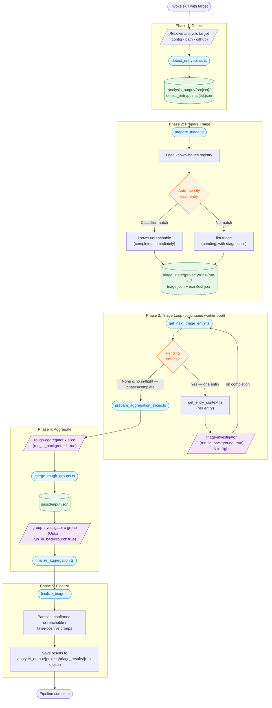

# Self-Repair Pipeline

Triage pipeline for entry point analysis: detect false positives and classify root causes.

Each invocation produces a self-contained run under `triage_state/<project>/runs/<run-id>/`. Run-id format is `<short-commit>-<iso-ts>` (or `nogit-<iso-ts>` for non-git projects). Re-running at the same target commit reuses prior `confirmed_unreachable` verdicts via the TP cache (skip with `--no-reuse-tp`). The classifier registry at `known_issues/registry.json` is also cross-run state, updated by the `triage-curator` skill.

Orthogonally, the `detect_dead_code` Stop hook (`.claude/hooks/detect_dead_code.ts`) reads a human-maintained whitelist at `~/.ariadne/self-repair-pipeline/known_entrypoints/<package>.json` to guard against dead code introduced during coding sessions. That whitelist is not read or written by any script in this skill — see [SKILL.md → Dead-code guardrail](SKILL.md#dead-code-guardrail).

## Pipeline Flow

```mermaid
flowchart TD
    START(["Invoke skill with target"]) --> RESOLVE

    %% ── Phase 1: Detect ─────────────────────────────────────
    subgraph P1["Phase 1: Detect"]
        RESOLVE[/"Resolve analysis target<br/>(config · path · github)"/]
        RESOLVE --> DETECT(["detect_entrypoints.ts"])
        DETECT --> ANALYSIS[("analysis_output/{project}/<br/>detect_entrypoints/{ts}.json")]
    end

    ANALYSIS --> PREPARE

    %% ── Phase 2: Prepare Triage ──────────────────────────────
    subgraph P2["Phase 2: Prepare Triage"]
        PREPARE(["prepare_triage.ts"]) --> LOAD_REG["Load known-issues registry"]
        LOAD_REG --> CLASSIFY{"Auto-classify<br/>each entry"}
        CLASSIFY -->|"Classifier match"| KNOWN_UR["known-unreachable<br/>(completed immediately)"]
        CLASSIFY -->|"No match"| LLM_TRIAGE["llm-triage<br/>(pending, with diagnostics)"]
        KNOWN_UR --> STATE
        LLM_TRIAGE --> STATE
        STATE[("triage_state/{project}/runs/{run-id}/<br/>triage.json + manifest.json")]
    end

    STATE --> LOOP_ENTRY

    %% ── Phase 3: Triage Loop ─────────────────────────────────
    subgraph P3["Phase 3: Triage Loop (continuous worker pool)"]
        LOOP_ENTRY(["get_next_triage_entry.ts"]) --> POOL_CHECK{"Pending<br/>entries?"}
        POOL_CHECK -->|"Yes — one entry"| CONTEXT["get_entry_context.ts<br/>(per entry)"]
        CONTEXT --> INVESTIGATORS[/"triage-investigator<br/>(run_in_background: true)<br/>N in flight"/]
        INVESTIGATORS -->|"on completion"| LOOP_ENTRY
        POOL_CHECK -->|"None &amp; no in-flight — phase=complete"| AGG_START
    end

    %% ── Phase 4: Aggregate ───────────────────────────────────
    subgraph P4["Phase 4: Aggregate"]
        AGG_START(["prepare_aggregation_slices.ts"])
        AGG_START --> ROUGH[/"rough-aggregator x slice<br/>(run_in_background: true)"/]
        ROUGH --> MERGE_ROUGH(["merge_rough_groups.ts"])
        MERGE_ROUGH --> PASS3_INPUT[("pass3/input.json")]
        PASS3_INPUT --> INVESTIGATORS2[/"group-investigator x group<br/>(Opus · run_in_background: true)"/]
        INVESTIGATORS2 --> FINALIZE_AGG(["finalize_aggregation.ts"])
    end

    FINALIZE_AGG --> FINALIZE

    %% ── Phase 5: Finalize ────────────────────────────────────
    subgraph P5["Phase 5: Finalize"]
        FINALIZE(["finalize_triage.ts"])
        FINALIZE --> PARTITION["Partition: confirmed-unreachable /<br/>false-positive groups"]
        PARTITION --> SAVE["Save results to<br/>analysis_output/{project}/triage_results/{run-id}.json"]
    end

    SAVE --> DONE(["Pipeline complete"])

    %% ── Styling ──────────────────────────────────────────────
    classDef script fill:#e1f5fe,stroke:#0288d1,color:#01579b
    classDef agent fill:#f3e5f5,stroke:#7b1fa2,color:#4a148c
    classDef decision fill:#fff3e0,stroke:#ef6c00,color:#e65100
    classDef data fill:#e8f5e9,stroke:#388e3c,color:#1b5e20

    class DETECT,PREPARE,FINALIZE,LOOP_ENTRY,AGG_START,MERGE_ROUGH,FINALIZE_AGG script
    class INVESTIGATORS,INVESTIGATORS2,ROUGH agent
    class CLASSIFY,POOL_CHECK decision
    class ANALYSIS,STATE,PASS3_INPUT data
```

## Sub-Agent Summary

| Agent               | Model  | Multiplicity              | Purpose                                                                                |
| ------------------- | ------ | ------------------------- | -------------------------------------------------------------------------------------- |
| triage-investigator | Sonnet | 1 per entry (worker pool) | Fetch own context via `get_entry_context.ts`, determine if Ariadne missed real callers |
| rough-aggregator    | Sonnet | 1 per slice               | Group false-positive entries by semantic similarity of root cause                      |
| group-investigator  | Opus   | 1 per group               | Verify per-entry group membership using source code and Ariadne MCP evidence           |

## Key Modules

See [SKILL.md → Architecture: Key Modules](SKILL.md#architecture-key-modules).
