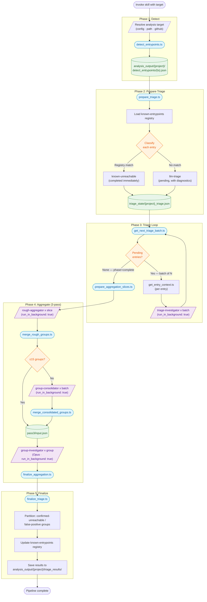

# Self-Repair Pipeline

Triage pipeline for entry point analysis: detect false positives, classify root causes, and update the known-entrypoints registry.

## Pipeline Flow


```mermaid
flowchart TD
    START(["Invoke skill with target"]) --> RESOLVE

    %% ── Phase 1: Detect ─────────────────────────────────────
    subgraph P1["Phase 1: Detect"]
        RESOLVE[/"Resolve analysis target<br/>(config · path · github)"/]
        RESOLVE --> DETECT(["detect_entrypoints.ts"])
        DETECT --> ANALYSIS[("analysis_output/{project}/<br/>detect_entrypoints/{ts}.json")]
    end

    ANALYSIS --> PREPARE

    %% ── Phase 2: Prepare Triage ──────────────────────────────
    subgraph P2["Phase 2: Prepare Triage"]
        PREPARE(["prepare_triage.ts"]) --> LOAD_REG["Load known-entrypoints registry"]
        LOAD_REG --> CLASSIFY{"Classify<br/>each entry"}
        CLASSIFY -->|"Registry match"| KNOWN_UR["known-unreachable<br/>(completed immediately)"]
        CLASSIFY -->|"No match"| LLM_TRIAGE["llm-triage<br/>(pending, with diagnostics)"]
        KNOWN_UR --> STATE
        LLM_TRIAGE --> STATE
        STATE[("triage_state/{project}_triage.json")]
    end

    STATE --> LOOP_ENTRY

    %% ── Phase 3: Triage Loop ─────────────────────────────────
    subgraph P3["Phase 3: Triage Loop"]
        LOOP_ENTRY(["get_next_triage_batch.ts"]) --> BATCH_CHECK{"Pending<br/>entries?"}
        BATCH_CHECK -->|"Yes — batch of N"| CONTEXT["get_entry_context.ts<br/>(per entry)"]
        CONTEXT --> INVESTIGATORS[/"triage-investigator x batch<br/>(run_in_background: true)"/]
        INVESTIGATORS --> LOOP_ENTRY
        BATCH_CHECK -->|"None — phase=complete"| AGG_START
    end

    %% ── Phase 4: Aggregate ───────────────────────────────────
    subgraph P4["Phase 4: Aggregate (3-pass)"]
        AGG_START(["prepare_aggregation_slices.ts"])
        AGG_START --> ROUGH[/"rough-aggregator x slice<br/>(run_in_background: true)"/]
        ROUGH --> MERGE_ROUGH(["merge_rough_groups.ts"])
        MERGE_ROUGH --> SKIP_CHECK{"≤15 groups?"}
        SKIP_CHECK -->|"Yes"| PASS3_INPUT[("pass3/input.json")]
        SKIP_CHECK -->|"No"| CONSOLIDATOR[/"group-consolidator x batch<br/>(run_in_background: true)"/]
        CONSOLIDATOR --> MERGE_CONSOL(["merge_consolidated_groups.ts"])
        MERGE_CONSOL --> PASS3_INPUT
        PASS3_INPUT --> INVESTIGATORS2[/"group-investigator x group<br/>(Opus · run_in_background: true)"/]
        INVESTIGATORS2 --> FINALIZE_AGG(["finalize_aggregation.ts"])
    end

    FINALIZE_AGG --> FINALIZE

    %% ── Phase 5: Finalize ────────────────────────────────────
    subgraph P5["Phase 5: Finalize"]
        FINALIZE(["finalize_triage.ts"])
        FINALIZE --> PARTITION["Partition: confirmed-unreachable /<br/>false-positive groups"]
        PARTITION --> UPD_REG["Update known-entrypoints registry"]
        UPD_REG --> SAVE["Save results to<br/>analysis_output/{project}/triage_results/"]
    end

    SAVE --> DONE(["Pipeline complete"])

    %% ── Styling ──────────────────────────────────────────────
    classDef script fill:#e1f5fe,stroke:#0288d1,color:#01579b
    classDef agent fill:#f3e5f5,stroke:#7b1fa2,color:#4a148c
    classDef decision fill:#fff3e0,stroke:#ef6c00,color:#e65100
    classDef data fill:#e8f5e9,stroke:#388e3c,color:#1b5e20

    class DETECT,PREPARE,FINALIZE,LOOP_ENTRY,AGG_START,MERGE_ROUGH,MERGE_CONSOL,FINALIZE_AGG script
    class INVESTIGATORS,INVESTIGATORS2,ROUGH,CONSOLIDATOR agent
    class CLASSIFY,BATCH_CHECK,SKIP_CHECK decision
    class ANALYSIS,STATE,PASS3_INPUT data
```

## Triage Investigator Context

The main agent runs `get_entry_context.ts` per entry to fetch the investigation prompt, then passes it directly to the triage-investigator sub-agent:

```bash
node --import tsx .claude/skills/self-repair-pipeline/scripts/get_entry_context.ts --entry 62
```

The script loads the entry, selects a diagnosis-specific prompt template, substitutes placeholders, and outputs the complete investigation prompt. The main agent passes this output verbatim as the sub-agent prompt.

## Diagnosis Routing

The `get_entry_context.ts` script maps each entry's `diagnosis` field to a prompt template:

| Diagnosis                          | Template                            | Focus                                     |
| ---------------------------------- | ----------------------------------- | ----------------------------------------- |
| `callers-not-in-registry`          | `prompt_callers_not_in_registry.md` | File coverage gap investigation           |
| `callers-in-registry-unresolved`   | `prompt_resolution_failure.md`      | Resolution failure pattern identification |
| `callers-in-registry-wrong-target` | `prompt_wrong_target.md`            | Wrong resolution target analysis          |
| All other                          | `prompt_generic.md`                 | Broad investigation                       |

## Sub-Agent Summary

| Agent               | Model  | Multiplicity          | Purpose                                                                                |
| ------------------- | ------ | --------------------- | -------------------------------------------------------------------------------------- |
| triage-investigator | Sonnet | 1 per entry (batched) | Fetch own context via `get_entry_context.ts`, determine if Ariadne missed real callers |
| rough-aggregator    | Sonnet | 1 per slice           | Group false-positive entries by semantic similarity of root cause                      |
| group-consolidator  | Sonnet | 1 per batch           | Merge synonymous group names across slices                                             |
| group-investigator  | Opus   | 1 per group           | Verify per-entry group membership using source code and Ariadne MCP evidence           |

## Key Modules

| Module                                  | Purpose                                                           |
| --------------------------------------- | ----------------------------------------------------------------- |
| `src/discover_state.ts`                 | Triage state file discovery                                       |
| `src/merge_results.ts`                  | Merge investigator result files into triage state                 |
| `src/build_triage_entries.ts`           | Convert classification → triage entries with embedded diagnostics |
| `src/build_finalization_output.ts`      | Build finalization output from completed state                    |
| `src/known_entrypoints.ts`              | Known-entrypoints registry I/O and matching                       |
| `src/triage_state_types.ts`             | State types (`TriageState`, `TriageEntry`, `TriageEntryResult`)   |
| `scripts/get_entry_context.ts`          | Diagnosis → template selection and placeholder substitution       |
| `scripts/get_next_triage_batch.ts`      | Merge results, return next pending batch, advance phase           |
| `scripts/prepare_aggregation_slices.ts` | Split false-positive entries into aggregation slices              |
| `scripts/merge_rough_groups.ts`         | Merge pass1 outputs; route to pass2 or pass3                      |
| `scripts/merge_consolidated_groups.ts`  | Merge pass2 outputs into canonical pass3 group list               |
| `scripts/finalize_aggregation.ts`       | Apply group assignments, handle rejections, set phase=complete    |
| `scripts/finalize_triage.ts`            | Partition results, update registry, save output                   |
