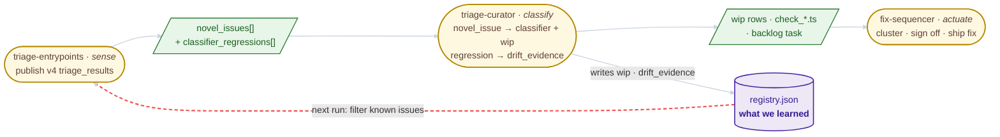
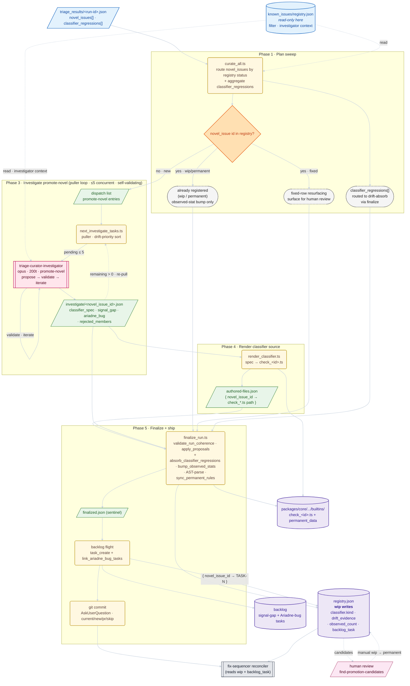
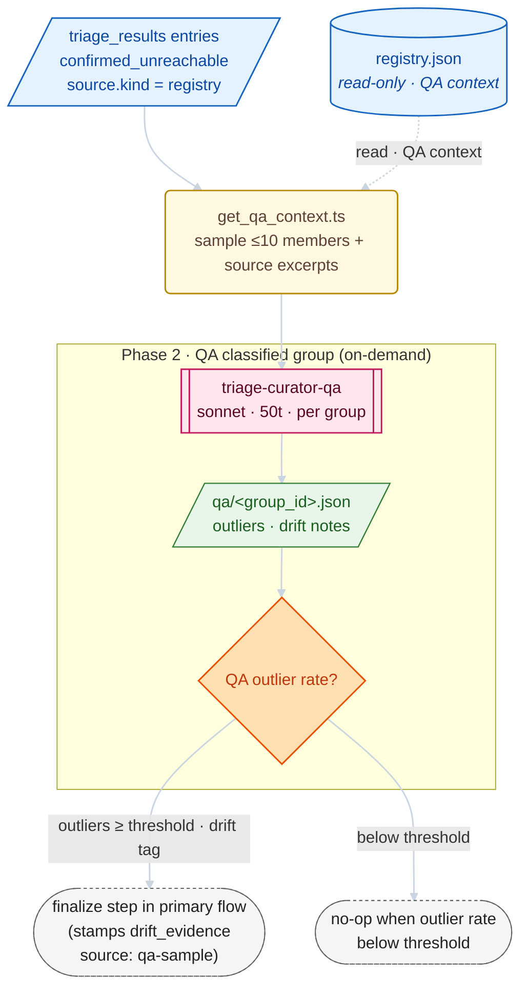

# triage-curator

Offline sweep over completed `triage-entrypoints` runs. Consumes the v4
`triage_results/<run-id>.json` published by triage-entrypoints —
specifically `novel_issues[]` (issues named by the per-entry investigator
and run-time coordinator) and `classifier_regressions[]` (in-flight
drift flags the per-entry investigator raised when a wip classifier
failed to match an entry it should have caught).

For each novel issue with no registry row yet, the curator dispatches a
single `triage-curator-investigator` (opus) to author a
`BuiltinClassifierSpec` plus an Ariadne-bug backlog task. For each
classifier-regression flag, the curator stamps `drift_evidence` onto
the existing wip row through the finalize step's drift-absorb path.
Already-registered novel issues only bump observed-stats. The sweep
ends by filing backlog tasks and committing.

## Pipeline Flow

(For where this skill fits in the broader chain see [triage-entrypoints → Self-healing pipeline](../triage-entrypoints/README.md#self-healing-pipeline).)

### Where this lands

The curator is the middle link in the self-healing chain. The touch-point
diagram below shows where the **primary trigger flow** attaches to
neighbouring skills — internals are folded.



**Where this lands**: three skills in a row (sense → classify → actuate);
the curator's two **primary triggers** are the `novel_issues[]` and
`classifier_regressions[]` slices of the latest `triage_results`, and its
primary outputs (wip row + classifier source + backlog task + drift
evidence) are exactly what `fix-sequencer` reads on the next run; one
durable surface (`registry.json`) sits below the chain and anchors the
loop-closure red dotted edge that fires on the _next_ triage-entrypoints
invocation.

**Primary trigger**: a `novel_issues[]` entry in a freshly published
`triage_results/<run-id>.json` whose `id` does not match a registry row.
The diagram below traces that flow from entry through to the `wip` row
in `registry.json`, the `check_<id>.ts` written to core builtins, and
the backlog task filed for the underlying signal/bug. Already-registered
novel issues skip the investigator wave and only contribute to
observed-stat bumps; `classifier_regressions[]` flow through the
drift-absorb path inside finalize. Validation is folded into the
investigator's own propose → validate → iterate loop, scoped to a
single response at a time.



**What to look for**: the registry-status branch in Phase 1 has three
labelled exits — `no · new` is the only arm that dispatches an
investigator; `yes · wip/permanent` short-circuits to finalize as an
observed-stat bump; `yes · fixed` short-circuits to finalize as a
resurfacing surfaced for human review (the curator never re-flips a
fixed row — that's the fix-sequencer reconciler's write boundary).
`classifier_regressions[]` enters Phase 1 as a parallel input and
flows directly to finalize's drift-absorb path; no investigator
dispatch. Promote-novel entries thread Phases 3 → 4 → 5 into a new
`check_<id>.ts`, a `wip` row, and a backlog task; four phase bands
stacked top-to-bottom (Phase 2 is reserved for the on-demand
maintenance flow below); two read-only inputs (`triage_results` +
`registry.json`) sit above the phase bands and only feed the steps
that touch them; one sub-agent on the primary path
(`triage-curator-investigator`, opus, ≤5 concurrent) which owns its
own propose → validate → iterate loop (the self-edge on `AG_INV`); one
contained back-edge inside Phase 3 (the puller re-pull when
investigation output remains). Cross-response coherence (two responses
targeting the same classifier file) is enforced once at the top of
Phase 5 by `finalize_run.ts` before any registry mutation, since the
per-response validator inside Phase 3 is scoped to a single response.
The `rejected_members` field on `INV_OUT` is the investigator's audit
trail for citations the chosen classifier cannot cover — those
citations re-surface as new novel-issue candidates on the next
triage-entrypoints run. The bottom-row stores make the curator's write
surface explicit: it is the **single autonomous writer of `wip` rows**;
`permanent` (human-edited, via `find-promotion-candidates`) and
`fixed` (`fix-sequencer` reconciler) are owned by other writers. The
on-demand QA maintenance flow and the `wip → permanent` human
promotion entry live in their own H2s below.

## Maintenance flow: on-demand QA of already-classified groups

On-demand QA pass against entries the upstream triage-entrypoints
classified via a registry rule (`confirmed_unreachable[]` rows with
`source.kind === "registry"`). Invoked manually via
`scripts/get_qa_context.ts --group <id> --run <triage_results.json>`;
the puller does not dispatch it from `curate_all`. The sub-agent
samples up to ten entries, decides which look like outliers, and any
drift it confirms lands in `drift_evidence` with `source: "qa-sample"`
through the same finalize path the in-flight regressions use.



**What to look for (maintenance)**: this flow is **on-demand** — no
puller dispatch, no inclusion in the `curate_all` plan. The sub-agent
samples members of one already-classified group via
`get_qa_context.ts`; the lone branch decision is "QA outlier rate?"
with two labelled exits. Above threshold, the run re-enters the
primary diagram at its finalize step (Phase 5) with a `drift_evidence`
row stamped `source: "qa-sample"` on the existing `wip` row — the same
shape the in-flight `classifier_regressions[]` path produces,
distinguished by `source`. Below threshold the QA result is a no-op.
This flow writes only `drift_evidence` rows and observed-stat
counters.

## Maintenance entries

### `wip → permanent` human promotion

Maintenance entry: the operator runs `pnpm find-promotion-candidates`,
hand-edits the `status` field of qualifying rows in `registry.json`,
then runs `pnpm sync-permanent-rules` to rebuild the bundled core
slice. This runs out-of-band of any curator sweep — there is no
`curate_all` invocation that produces it. The `REG_W ↔ HUMAN` dotted
cycle in the primary diagram visualizes the data flow this loop
participates in; the loop itself is invoked separately.

## Authored classifiers

Builtin classifiers live at
`packages/core/src/classify_entry_points/builtins/check_<id>.ts`. The
finalize step writes them across the package boundary into core; the CI
gate `pnpm check-permanent-rules` keeps the bundled permanent slice
(`packages/core/src/classify_entry_points/permanent_data.ts`) and the
builtins barrel in sync with the curator's working registry at
`.claude/skills/triage-entrypoints/known_issues/registry.json`.

Each `check_*.ts` file is a **pure function of its
`BuiltinClassifierSpec`** — the investigator emits the spec, the main
agent runs `render_classifier.ts`, and the rendered source is written
to disk. Finalize AST-parses each file before upserting the registry.
Never hand-edit a generated classifier; change the spec (or flip the
registry entry to `status: "permanent"` to lock it) and re-run the
sweep.

Sub-agents:

- `.claude/agents/triage-curator-investigator.md` — opus, 200 turns,
  primary path (promote-novel)
- `.claude/agents/triage-curator-qa.md` — sonnet, 50 turns, on-demand
  maintenance only

## Run the sweep

```bash
# From the repo root
node --import tsx .claude/skills/triage-curator/scripts/curate_all.ts --dry-run
```

Or via Claude: `/triage-curator [--project <name>] [--dry-run]`.

## Tests

```bash
cd .claude/skills/triage-curator
pnpm test
```

## State files

- `~/.ariadne/triage-curator/runs/<run_id>/{qa,investigate}/*.json` —
  per-group sub-agent output (inputs to `finalize_run.ts`).
- `~/.ariadne/triage-curator/runs/<run_id>/investigate/<novel_issue_id>.session.json` —
  investigator session log, one per dispatch.
- `~/.ariadne/triage-curator/runs/<run_id>/finalized.json` — written by
  finalize; its presence marks the run as curated and makes scan skip
  it.
