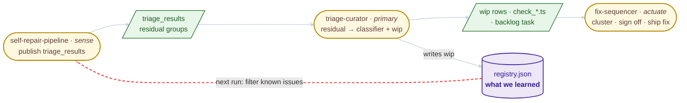
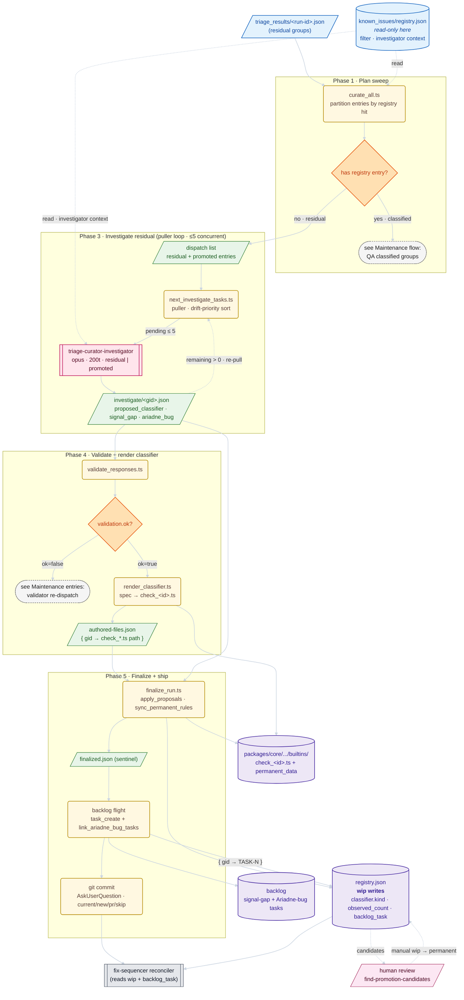
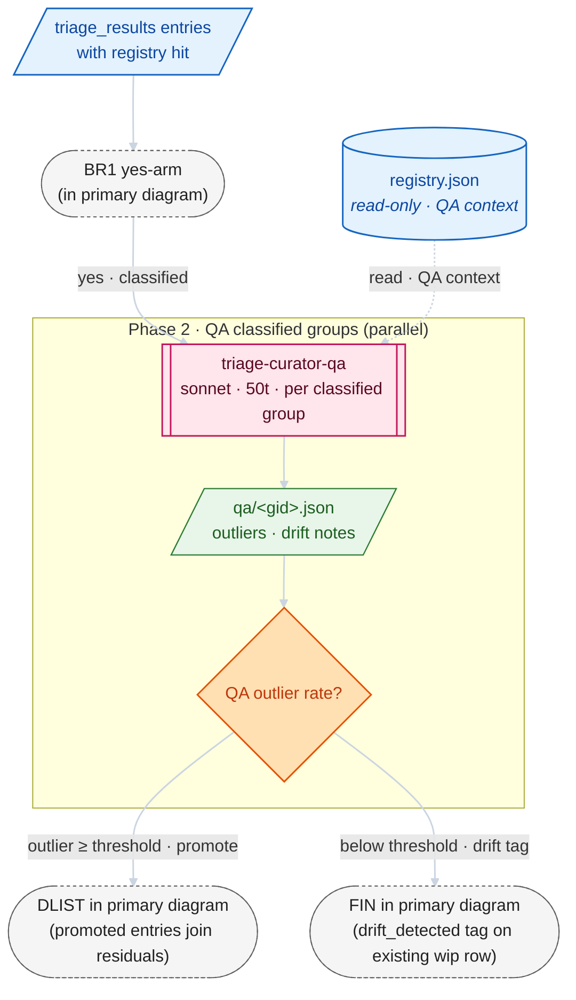
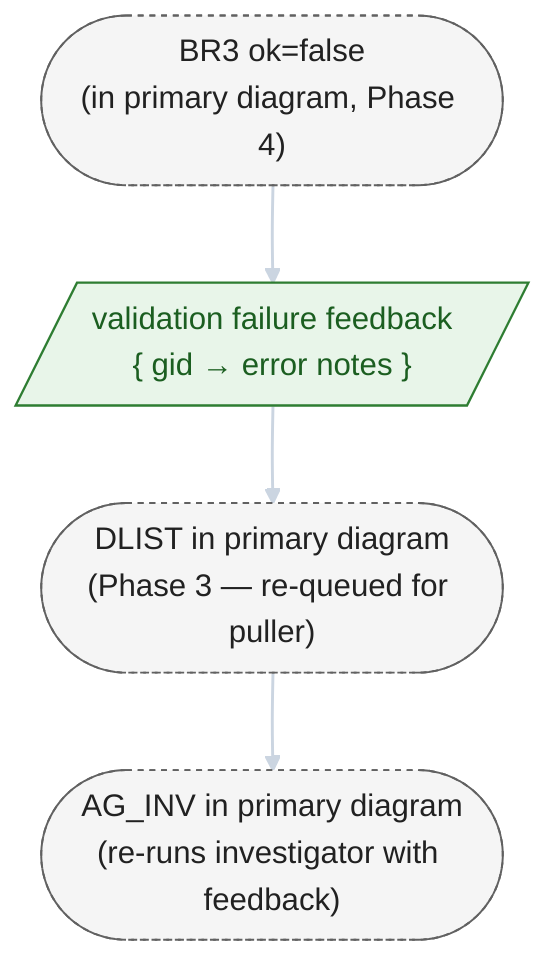

# triage-curator

Offline sweep over completed `self-repair-pipeline` runs. Audits
auto-classified false-positive groups, investigates residuals, produces
classifier + backlog + signal proposals, and commits the result.

## Pipeline Flow

(For where this skill fits in the broader chain see [self-repair-pipeline → Self-healing pipeline](../self-repair-pipeline/README.md#self-healing-pipeline).)

### Where this lands

The curator is the middle link in the self-healing chain. The touch-point diagram below shows where the **primary trigger flow** attaches to neighbouring skills — internals are folded.



**Where this lands**: three skills in a row (sense → classify → actuate); the curator's **primary trigger** is a residual group from the latest `triage_results`, and its primary outputs (wip row + classifier source + backlog task) are exactly what `fix-sequencer` reads on the next run; one durable surface (`registry.json`) sits below the chain and anchors the loop-closure red dotted edge that fires on the _next_ SRP invocation. Internals deferred to the per-step diagram below — the QA-of-classified-groups flow is a maintenance sibling diagrammed in its own H2.

**Primary trigger**: a residual group in a freshly published `triage_results/<run-id>.json` that has no matching registry entry; this diagram traces that flow from entry through to the `wip` row in `registry.json`, the `check_<id>.ts` written to core builtins, and the backlog task filed for the underlying signal/bug. Maintenance flows live below.



**What to look for**: residual groups (the `no` arm of `BR1`) thread Phases 3 → 4 → 5 into a new `check_<id>.ts`, a `wip` row, and a backlog task; four phase bands stacked top-to-bottom (Phase 2's QA loop is omitted — see [_Maintenance flow_](#maintenance-flow-qa-of-already-classified-groups) below); two read-only inputs (`triage_results` + `registry.json`) sit on the left rail and only feed the steps that touch them; one sub-agent on the primary path (`triage-curator-investigator`, opus, ≤5 concurrent); one contained back-edge inside Phase 3 (`INV_OUT → PULL`, puller re-pull); two branch decisions gate the forward flow (`has registry entry?` with `yes` stubbed to the maintenance flow, and `validation.ok?` with `false` stubbed to a maintenance entry). The bottom-row stores make the curator's write surface explicit: it is the **single autonomous writer of `wip` rows** — `permanent` (human-edited, via `find-promotion-candidates`) and `fixed` (`fix-sequencer` reconciler) are owned by other writers. Maintenance flows (`QA of already-classified groups` below) and self-triage entries (`validator re-dispatch`; `wip → permanent` human promotion) are noted separately so the primary stays a clean top-down flow.

## Maintenance flow: QA of already-classified groups

Maintenance flow: drift detection over groups that already match a registry entry. Fires when `curate_all.ts` finds entries whose `gid` already has a classifier hit — the `yes · classified` arm of `BR1` in the primary diagram. Reuses Phase 1 (`S1`, `BR1`), Phase 3's dispatch list (`DLIST`), and Phase 5's finalize step (`FIN`) from the primary diagram (not redrawn). The surface this flow exposes that the primary does not is the `triage-curator-qa` sub-agent and its drift signal — outliers above threshold are _promoted back_ into the investigator queue; everything below threshold short-circuits to finalize with a `drift_detected` tag.



**What to look for (maintenance)**: classified groups (the `yes` arm of `BR1` in the primary) get parallel QA from `triage-curator-qa` (sonnet, 50t, per group); the lone branch decision is `QA outlier rate?` with two labelled exits — outliers above threshold re-enter the primary diagram at `DLIST` (promoting the group back into investigation as if it were residual); everything below threshold re-enters the primary diagram at `FIN` with a `drift_detected` tag on the existing `wip` row. This flow never authors a new classifier; it only mutates `drift_detected` and `observed_count` on rows the primary flow already wrote. Re-enters the primary diagram at `DLIST` (Phase 3) and `FIN` (Phase 5).

## Maintenance entries

Self-triage loops factored out of the primary diagram because their back-edges would otherwise flatten the primary's vertical layout (see [skill-diagrammer · anatomy.md → Layout pitfalls](../../../../.claude/skills/skill-diagrammer/anatomy.md#layout-pitfalls)).

### Validator re-dispatch

Maintenance entry: when `validate_responses.ts` rejects an investigator's proposed classifier spec (the `BR3 = ok=false` arm in the primary, stubbed via `MX2`), the gid plus per-error feedback notes are appended back to the dispatch list; the puller picks the gid up again and re-runs `triage-curator-investigator` with the failure feedback in context. The loop continues until validation passes (control re-enters the primary flow at `BR3 = ok=true → REND`) or the puller hits a retry limit.



**What to look for (maintenance entry)**: three anchor `inter` nodes (`BR3`, `DLIST`, `AG_INV`) match the primary diagram by Mermaid ID — the loop closes through them. One new artifact (`validation failure feedback`) is unique to this entry and is not present in the primary. Re-enters the primary diagram at `DLIST` (Phase 3) on the failure arm, and rejoins the primary's `BR3 → REND` arm only after validation eventually passes.

### `wip → permanent` human promotion

Maintenance entry: the operator runs `pnpm find-promotion-candidates`, hand-edits the `status` field of qualifying rows in `registry.json`, then runs `pnpm sync-permanent-rules` to rebuild the bundled core slice. This runs out-of-band of any curator sweep — there is no `curate_all` invocation that produces it. The `REG_W ↔ HUMAN` dotted cycle in the primary diagram visualizes the data flow this loop participates in; the loop itself is invoked separately.

## Authored classifiers

Builtin classifiers live at
`packages/core/src/classify_entry_points/builtins/check_<group_id>.ts`. The
finalize step writes them across the package boundary into core; the CI gate
`pnpm check-permanent-rules` keeps the bundled permanent slice
(`packages/core/src/classify_entry_points/permanent_data.ts`) and the builtins
barrel in sync with the curator's working registry at
`.claude/skills/self-repair-pipeline/known_issues/registry.json`.

Each `check_*.ts` file is a **pure function of its `BuiltinClassifierSpec`** —
the investigator emits the spec, the main agent runs `render_classifier.ts`,
and the rendered source is written to disk. Finalize AST-parses each file
before upserting the registry. Never hand-edit a generated classifier; change
the spec (or flip the registry entry to `status: "permanent"` to lock it) and
re-run the sweep.

Sub-agents:

- `.claude/agents/triage-curator-qa.md` — sonnet, 50 turns
- `.claude/agents/triage-curator-investigator.md` — opus, 200 turns

## Run the sweep

```bash
# From the repo root
node --import tsx .claude/skills/triage-curator/scripts/curate_all.ts --dry-run
```

Or via Claude: `/triage-curator [--project <name>] [--dry-run]`.

## Tests

```bash
cd .claude/skills/triage-curator
pnpm test
```

## State files

- `~/.ariadne/triage-curator/runs/<run_id>/{qa,investigate}/*.json` —
  per-group sub-agent output (inputs to `finalize_run.ts`).
- `~/.ariadne/triage-curator/runs/<run_id>/investigate/<group_id>.session.json` —
  investigator session log, one per dispatch.
- `~/.ariadne/triage-curator/runs/<run_id>/finalized.json` — written by
  finalize; its presence marks the run as curated and makes scan skip it.
