# Triage Entrypoints

Triage pipeline for entry point analysis: detect false positives and classify root causes. The per-entry `triage-investigator` emits one `TriageVerdict` — a discriminated union with `tp`, `fp-novel-new`, `fp-novel-cited`, `fp-classifier-regression`, or `uncertain` arms. A `triage-coordinator` sub-agent dedupes each novel verdict against the run's `novel_issues.json` snapshot inline, so the curator downstream consumes a pre-consolidated novel-issue set.

Each invocation produces a self-contained run under `triage_state/<project>/runs/<run-id>/`. Run-id format is `<short-commit>-<iso-ts>` (or `nogit-<iso-ts>` for non-git projects). Re-running at the same target commit reuses prior `confirmed_unreachable` verdicts via the TP cache (skip with `--no-reuse-tp`). The classifier registry at `known_issues/registry.json` is the canonical registry, updated by the `triage-curator` skill. A generated `permanent`-status slice is bundled into `@ariadnejs/core` at `packages/core/src/classify_entry_points/permanent_data.ts`, so library consumers of `Project.get_call_graph()` filter framework noise without depending on this skill. Regenerate the slice with `pnpm sync-permanent-rules` (run pre-commit on registry edits and verified in CI).

Orthogonally, the `detect_dead_code` Stop hook (`.claude/hooks/detect_dead_code.ts`) reads a human-maintained whitelist at `~/.ariadne/triage-entrypoints/known_entrypoints/<package>.json` to guard against dead code introduced during coding sessions. That whitelist is not read or written by any script in this skill — see [SKILL.md → Dead-code guardrail](SKILL.md#dead-code-guardrail).

## Self-healing pipeline

This skill is the first link in a three-skill chain: triage-entrypoints (sense) → triage-curator (classify) → fix-sequencer (actuate). It is _self-healing_ because two durable surfaces survive between runs — `registry.json` (what we learned) and the target repo (what we changed) — and both are read on the _next_ triage-entrypoints run. The two red dotted edges below are the loop closure.

<!-- Source: ./README.pipeline.mmd — edit there, run `pnpm render-mermaid-diagrams` -->

**Reading the diagram**: three skills feed forward (sense → classify → actuate); two durable surfaces (registry + target repo) survive between runs and feed the next iteration; the two red dotted edges are the loop closure — both fire on the _next_ triage-entrypoints invocation, not synchronously. See per-step diagrams below and sibling READMEs for the registry lifecycle states + writers, the worker / reconciler / git-log scanner nodes, sub-agent fleets, the per-cluster sign-off branch, and all other persistent stores.

## Pipeline Flow

This skill's internal flow is a top-down 5-phase pipeline. Read-only stores sit on a left rail and only feed the phases that touch them; the published `triage_results/<run-id>.json` fans out to three downstream consumers and (on the _next_ same-commit run) becomes the TP-cache source.

<!-- Source: ./README.per-step.mmd — edit there, run `pnpm render-mermaid-diagrams` -->

**What to look for**: four phase bands stacked top-to-bottom (strict reading order); two read-only stores (registry, prior triage_results) sit outside the phase bands — this skill **never** writes the registry (lifecycle contract); three Phase-2 buckets (auto / TP / residual) determine whether an entry skips the triage loop entirely. The dispatcher is the **single writer** of both `novel_issues.json` (atomic, via the coordinator path on novel verdicts) and `classifier_regressions.jsonl` (append-only, directly on `fp-classifier-regression`). The coordinator sub-agent only fires on novel verdicts; `tp` and `uncertain` are absorbed in-memory and surfaced at finalize. Each run's published `triage_results` becomes the next same-commit run's TP cache.

## Sub-Agent Summary

| Agent               | Model  | Multiplicity              | Purpose                                                                                |
| ------------------- | ------ | ------------------------- | -------------------------------------------------------------------------------------- |
| triage-investigator | Sonnet | 1 per entry (worker pool) | Fetch own context via `get_entry_context.ts`, emit one `TriageVerdict`                 |
| triage-coordinator  | Sonnet | 1 per novel absorb        | Sense-check novel verdicts against the run's `novel_issues.json`; merge / register / flag |

## Key Modules

See [SKILL.md → Architecture: Key Modules](SKILL.md#architecture-key-modules).
