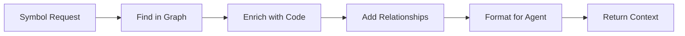

# Context-Oriented MCP Tools: Implementation Plan

## Overview

Transform Ariadne MCP from position-based navigation to context-rich information tools that work seamlessly with generation-oriented coding agents.

## Priority Tools

Based on agent compatibility analysis, prioritize tools that provide maximum value with minimum integration friction.

### Priority 1: `get_symbol_context` (Week 1-2)

**Why first**: Most immediately useful, builds on existing Ariadne capabilities

**Implementation steps:**

```typescript
// packages/mcp/src/tools/get_symbol_context.ts

export async function getSymbolContext(params: {
  symbol: string;          // Symbol name or code snippet
  searchScope?: "file" | "project" | "dependencies";
  includeTests?: boolean;
}) {
  // Step 1: Symbol resolution (no position needed)
  const symbols = await project.findSymbolsByName(params.symbol);
  
  // Step 2: Handle ambiguity
  const symbol = await disambiguateSymbol(symbols, params);
  
  // Step 3: Gather context
  const definition = await getDefinitionWithCode(symbol);
  const references = await project.getReferences(symbol);
  const relationships = await analyzeRelationships(symbol);
  
  // Step 4: Format for agents
  return formatSymbolContext({
    symbol,
    definition,
    usage: categorizeReferences(references),
    relationships,
    contextSnippet: extractRelevantContext(definition)
  });
}
```

### Priority 2: `get_code_structure` (Week 2-3)

**Why second**: Provides project-wide context, essential for understanding

**Implementation approach:**

```typescript
export async function getCodeStructure(params: {
  path: string;
  depth?: number;
  includeTests?: boolean;
}) {
  // Leverage Ariadne's existing project analysis
  const modules = await analyzeModules(params.path);
  const abstractions = await extractKeyAbstractions(modules);
  const patterns = await detectPatterns(modules);
  
  return {
    modules: summarizeModules(modules),
    keyAbstractions: abstractions,
    patterns: patterns,
    entryPoints: findEntryPoints(modules),
    testCoverage: calculateCoverage(modules)
  };
}
```

### Priority 3: `find_related_code` (Week 3-4)

**Why third**: Powerful for understanding patterns, builds on previous tools

**Key features:**
- Pattern matching using Ariadne's AST
- Semantic similarity using embeddings
- Test-to-implementation mapping

## Technical Architecture

### 1. Adapter Layer

Create an adapter that translates context requests to Ariadne's existing graph operations:

```typescript
class AriadneContextAdapter {
  constructor(private project: Project) {}
  
  // Translate high-level context requests to graph queries
  async getSymbolInfo(name: string) {
    // Use existing Ariadne methods
    const files = await this.project.getFiles();
    const symbols = [];
    
    for (const file of files) {
      const sourceFile = await this.project.getSourceFile(file);
      const fileSymbols = await findSymbolsInFile(sourceFile, name);
      symbols.push(...fileSymbols);
    }
    
    return symbols;
  }
}
```

### 2. Context Enrichment Pipeline



### 3. Caching Strategy

Cache frequently requested context to improve performance:

```typescript
class ContextCache {
  private cache = new Map<string, CachedContext>();
  private projectVersion: string;
  
  async get(key: string): Promise<Context | null> {
    const cached = this.cache.get(key);
    if (cached && cached.version === this.projectVersion) {
      return cached.context;
    }
    return null;
  }
}
```

## Integration Examples

### Week 4: Create Agent Adapters

**Aider Adapter:**
```python
class AriadneContextProvider:
    def __init__(self, mcp_client):
        self.mcp = mcp_client
    
    def enhance_edit_context(self, file_path, search_text):
        # Get symbol context for better SEARCH blocks
        symbols = self.extract_symbols(search_text)
        contexts = []
        
        for symbol in symbols:
            context = self.mcp.get_symbol_context(symbol)
            contexts.append(self.format_for_aider(context))
        
        return "\n".join(contexts)
```

**Continue Integration:**
```typescript
// New Continue commands
const ariadneCommands = {
  "/explain": async (selection) => {
    const context = await ariadne.get_symbol_context(selection);
    return formatExplanation(context);
  },
  
  "/impact": async (selection) => {
    const impact = await ariadne.analyze_code_impact(selection);
    return formatImpactReport(impact);
  }
};
```

## Testing Strategy

### 1. Unit Tests

Test each context tool independently:

```typescript
describe('get_symbol_context', () => {
  it('should find symbol without position', async () => {
    const context = await getSymbolContext({ symbol: 'startServer' });
    expect(context.definition.file).toBe('src/server.ts');
    expect(context.usage.direct_references).toHaveLength(3);
  });
  
  it('should handle ambiguous symbols', async () => {
    const context = await getSymbolContext({ symbol: 'config' });
    expect(context.disambiguation_hints).toBeDefined();
  });
});
```

### 2. Integration Tests

Test with real agent scenarios:

```typescript
describe('Agent Integration', () => {
  it('should provide context for Aider edits', async () => {
    const query = "Add error handling to startServer";
    const context = await getRelevantContext(query);
    
    expect(context).toContain('definition');
    expect(context).toContain('error patterns');
    expect(context).toContain('related functions');
  });
});
```

### 3. Performance Benchmarks

Ensure context retrieval is fast enough for interactive use:

- Symbol context: < 100ms
- Code structure: < 500ms for medium projects
- Related code: < 200ms

## Migration Path

### Phase 1: Parallel Implementation (Week 1-4)
- Keep existing navigation tools
- Add context tools alongside
- Test with early adopters

### Phase 2: Agent Integration (Week 5-6)
- Create adapters for each agent type
- Document usage patterns
- Gather feedback

### Phase 3: Full Migration (Week 7-8)
- Deprecate navigation tools
- Update all documentation
- Release context-oriented MCP

## Success Metrics

1. **Adoption Rate**: 80% of agents use context tools over navigation
2. **Performance**: 95% of requests complete in < 200ms
3. **Accuracy**: 90% of symbol queries return correct context
4. **Agent Satisfaction**: Reduced position-related errors by 90%

## Risk Mitigation

### Risk 1: Performance Degradation
**Mitigation**: Implement aggressive caching, lazy loading

### Risk 2: Breaking Changes
**Mitigation**: Maintain backwards compatibility during migration

### Risk 3: Complex Symbol Resolution
**Mitigation**: Provide disambiguation UI/API when multiple matches

## Next Steps

1. **Immediate**: Prototype `get_symbol_context` with existing Ariadne
2. **Week 1**: Implement core context extraction logic
3. **Week 2**: Add relationship analysis
4. **Week 3**: Create first agent adapter (Continue)
5. **Week 4**: Beta test with real projects