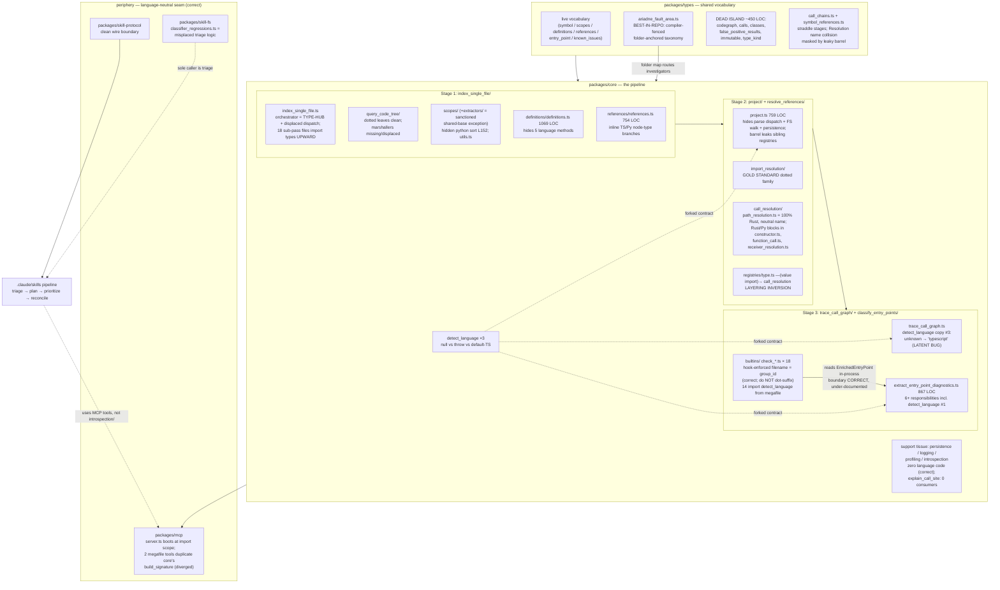

# IA Review — The Information-Architecture Picture

Scope: the full monorepo — `packages/core`, `packages/types`, `packages/mcp`, `packages/skill-fs`, `packages/skill-protocol` — judged against the intention tree (detect call graphs → find entry points), the NAME-ACCURACY test (a module is correctly sized when its name describes ALL its contents), and the ROUTING test (file/folder names alone route a maintainer to the right location). Every load-bearing claim cited below is verified against source. This document is the analysis; the sibling `ia-review.` draft defines the refactor program.

---

## 1. Intention tree versus module tree

### 1.1 Where they align

At the folder grain, the module tree is a faithful instantiation of the intention tree, and this is worth stating plainly because everything below is a one-level-down critique of an architecture whose skeleton is sound:

- **Stage 1** — `packages/core/src/index_single_file/` gives each of the four passes its own folder (`query_code_tree/`, `scopes/`, `definitions/`, `references/`), with the three per-language subsystems correctly nested under pass 1.
- **Stage 2** — `packages/core/src/resolve_references/` decomposes along the pipeline's own phases (`import_resolution/`, `registries/`, `call_resolution/`, `type_preprocessing/`); every folder name passes the routing test.
- **Stage 3** — `packages/core/src/trace_call_graph/` and `packages/core/src/classify_entry_points/` split detection from classification; `classify_entry_points/builtins/` is the concrete home of "language-specific filtering."
- **Support tissue** (`persistence/`, `logging/`, `profiling/`, `introspection/`) sits beside the pipeline without impersonating a stage, and correctly contains **zero** language-specific code — the healthy negative space of the language axis.
- **The periphery** holds the language axis OUT: `skill-protocol`'s wire schema (`packages/skill-protocol/src/triage_results.ts`, `kind: function|method|constructor`, no language discriminator) is the deliberate neutral seam; nothing in `mcp`/`skill-fs`/`skill-protocol` reaches into core internals.
- **The pipeline contract layer** — `packages/types/src/ariadne_fault_area.ts` — is the best-designed interface in the repo (§5.1).

### 1.2 Where structure diverges from purpose

The divergences are not scattered noise; they cluster into six repo-wide shapes.

**(1) Orchestrators that silently became hubs.** `index_single_file/index_single_file.ts` is simultaneously the stage orchestrator, the shared type-hub (`CaptureNode`, `ProcessingContext`, `SemanticCategory`, `SemanticEntity`), and a hand-enumerated language-dispatch point (the `get_metadata_extractors` switch, and the `reset_js/python/rust_documentation()` triple at lines 138–140 reaching two folder levels down into `symbol_factories.{lang}.ts` leaves). Eighteen sub-pass files import their fundamental wire types **upward** from the orchestrator — the dependency arrow inverted across the whole stage. `project/project.ts` (759 LOC) repeats the shape: parse-phase language dispatch (`detect_language` L60, `get_parser`, all four tree-sitter imports), a recursive filesystem walk (`get_file_tree`), and persistence (`save()`) all hide behind an orchestrator name.

**(2) Megafiles whose name covers only the trunk.** `classify_entry_points/extract_entry_point_diagnostics.ts` (867 LOC: diagnostics core + grep-index builder + syntactic-feature derivation + JS/TS-only definition-feature derivation + an async FS-touching test-grep pass + three unrelated shared utilities including `detect_language`); `index_single_file/definitions/definitions.ts` (1069 LOC, four Rust-only and one Python-only method buried in a neutral `DefinitionBuilder`); the four `symbol_factories.{lang}.ts` files (835–993 LOC, ~10 responsibilities each); `mcp/src/tools/core/list_entrypoints.ts` (463 LOC) and `show_call_graph_neighborhood.ts` (620 LOC), four responsibilities each.

**(3) Language logic in neutral-named bodies** — the single largest defect class, detailed in §3.

**(4) `detect_language` triplicated with a forked contract.** Three real definitions, verified: `classify_entry_points/extract_entry_point_diagnostics.ts:718` returns `Language | null`; `project/project.ts:60` **throws** on unknown extensions; `trace_call_graph/trace_call_graph.ts:22` **defaults to `"typescript"`** on unknown. Three different answers to the entry-gate question of a multi-language analyzer. The trace-phase default is a latent bug: an unknown extension reaching the trace stage is silently analyzed as TypeScript.

**(5) Barrel decay.** `resolve_references/index.ts` is a dead barrel (a doc comment, zero exports, zero importers). `persistence/index.ts` is bypassed by every internal consumer. `project/index.ts` re-exports five registries **from `resolve_references/`** (ownership blur) while omitting `project/`'s own surface (`load_project`, `is_test_file`, `file_loading` symbols), forcing `core/src/index.ts` to bypass into four deep paths. The `types` barrel selectively omits `query.ts`'s `Resolution<T>`/`is_resolution`, masking a name collision with `symbol_references.ts`'s `Resolution`.

**(6) Surplus code the constitution forbids.** `packages/types/src` carries a self-contained dead island — `codegraph.ts`, `calls.ts`, `classes.ts`, `false_positive_results.ts`, `immutable.ts`, `type_kind.ts`, the death-row `aliases.ts` — roughly 450 LOC of public type surface with zero non-test consumers, kept alive only by mutual intra-package reference and the barrel. `false_positive_results.ts` is a stale duplicate of the triage wire schema now owned by `skill-protocol/src/triage_results.ts`; deletion, not rename, is correct. Smaller instances: `registries/definition.ts`'s `scope_to_definitions_index` (built and maintained, no getter, no reader), `symbol_factories/types.ts` (single dead type), `introspection/list_name_collisions.ts` and `explain_call_site` (zero production consumers — see §5.3).

**Stage-order inversions** (all verified): `registries/type.ts:20` value-imports `resolve_namespace_export` from `call_resolution/method_lookup` — a stage-2 data store depending on the call-resolution logic layer, a soft cycle; `call_resolution/call_resolver.ts` value-imports `find_enclosing_function_scope` from stage-1 `index_single_file/scopes/utils`; `project/import_graph.ts` imports resolution functions from `resolve_references/import_resolution` (project should feed resolution, not depend on it); `persistence/serialize_index.ts` sources `SemanticIndex` from a deep stage-1 path rather than a types boundary; `types/symbol_definitions.ts` pulls the stage-3 `CallbackContext` into a stage-1 definition type.

---

## 2. Q1 — Dotted language files versus language sub-folders

**Recommendation: keep the dotted `{feature}.{language}.ts` mechanism as the default. Do not adopt language sub-folders per feature, and do not adopt per-language top-level modules. The existing two-tier rule — dotted by default, a prefix-named sub-folder only where language leaves share a base class — is correct and already hook-enforced; the work is to apply it consistently, not to change it.**

The decisive asymmetry: a language directory forces language to be the primary axis for every file inside it; a dotted suffix lets language be secondary on a feature-primary name. Ariadne's changes are overwhelmingly feature-primary (fix a resolver, fix a handler), so dotted wins the routing test (`import_resolution.python.ts` is one unambiguous hop; `import_resolution/python.ts` yields N indistinguishable `python.ts` files in a fuzzy finder), editor ergonomics (variants sort adjacent), test colocation (the file-naming hook's stacked-suffix grammar — `.python.integration.test.ts` — is built for it, with 40+ colocated dotted test files in the tree), and shared-logic homing (the neutral `{feature}.ts` marshaller sits beside its leaves). Per-language top-level modules additionally invert the intention tree — `CLAUDE.md` makes the pipeline stages, not the languages, the module layout — and orphan all shared logic.

Three scoped exceptions are part of the answer, not counter-evidence:

1. **Shared-base sub-folder.** `index_single_file/scopes/extractors/` uses prefix naming (`python_scope_boundary_extractor.ts`) because `javascript_typescript_scope_boundary_extractor.ts` is a genuine _two-language_ base class that no single dotted suffix can name. `.claude/hooks/file_naming.ts` carves this out explicitly (`EXTRACTOR_DIRS`). This is the sanctioned narrow exception, only for shared-base hierarchies.
2. **`builtins/` uses language-in-`group_id` + inline guard, by enforced design.** `.claude/hooks/file_naming.ts:50` (`KEBAB_FILENAME_DIRS = ["builtins"]`) enforces `filename === group_id + ".ts"` with a regex that has no dot alternation — `check_….python.ts` is structurally rejected. The filename↔group_id invariant is load-bearing for the classifier renderer and `reconcile_registry.ts` row↔file mapping. Layer-1 recommendations to add dotted suffixes or snake_case renames here fight an enforced design and are rejected.
3. **`packages/types` uses embedded annotated unions.** Union members cannot be additively contributed from separate files the way functions can; dotted files are net-negative there. The right fix is a grep-able `@language` annotation convention on every language-specific union member, plus fixing `type_id.ts`'s silent, unannotated JS/TS-only scope.

**The mechanism is fine; the dispatch placement is broken.** The real language-axis defect, uniform across every stage, is that the mechanism is bypassed: displaced marshallers (`metadata_extractors/` dispatches from `index_single_file.ts`; `symbol_factories/` has no marshaller at all), whole-language files with neutral names (`call_resolution/path_resolution.ts` is 100% Rust — `PATH_ANCHORS = {crate, self, super}`, Rust named in line 1 — yet not `.rust.ts`), and hidden inline branches (`scopes/scopes.ts:152` `if (file.lang === "python")`; ~120 LOC of Rust in `constructor.ts`; the `.endsWith(".py")` gate in `function_call.ts`; TS/Python node-type branches in `references/references.ts`). Fixing those — with the mechanism the repo already endorses — is the whole of the answer.

The terminal rule belongs in `.claude/rules/file-naming.md` as a decided matter: dotted suffix is the default; prefix sub-folders only for shared-base hierarchies; `builtins/` keeps language-in-group_id; `types` keeps annotated unions; language sub-folders per feature and per-language top-level modules are prohibited.

---

## 3. Q2 — Naming expressiveness and module granularity

### 3.1 The systemic pattern

The routing drill across twelve representative bug reports scores **1 clean, 1 partial, 10 fail**. Every failure reduces to one of five name pathologies:

| Pathology                                                             | Instances (verified)                                                                                                                                                                                                                                                                                                                                                                                                                                      |
| --------------------------------------------------------------------- | --------------------------------------------------------------------------------------------------------------------------------------------------------------------------------------------------------------------------------------------------------------------------------------------------------------------------------------------------------------------------------------------------------------------------------------------------------- |
| **Generic/category name** — banned by the repo's own `file-naming.md` | `scopes/utils.ts` (scope matching + traversal), `types/src/common.ts` (spatial primitives + cycle-breaking parking), three `types.ts` files under `query_code_tree/`, `skill-fs/src/errors.ts` (one function), `introspection/` (a stance word, not a concern), `mcp/analytics/analytics.ts` (folder-name tautology)                                                                                                                                      |
| **Folder-repeat file that is not the folder's main implementation**   | `classify_entry_points.ts` (a sub-step; the stage face is `enrich_call_graph.ts`), `resolve_references.ts` (holds `class ResolutionRegistry` — a store, not logic; stale `resolution_registry.*` dist fossils confirm a reverted rename), `definitions/definitions.ts`. The other six folder-repeat files (`project.ts`, `trace_call_graph.ts`, `import_resolution.ts`, …) are the convention working correctly — the rule is honored 6 times, violated 3 |
| **Megafile — name covers the trunk, not the branches**                | `extract_entry_point_diagnostics.ts` (867), `definitions.ts` (1069), `symbol_factories.{lang}.ts` (835–993), `list_entrypoints.ts` (463), `show_call_graph_neighborhood.ts` (620), `load_project.ts` (cache strategy folded into "load")                                                                                                                                                                                                                  |
| **Wholly-language content behind a neutral name**                     | `path_resolution.ts` (Rust), `derive_definition_features` (JS/TS-only, inside the megafile), plus every hidden branch in §2                                                                                                                                                                                                                                                                                                                               |
| **Outright misnomer / inversion**                                     | `extract_nested_definitions.ts` (extracts only parameters), `mcp/src/server.ts` (CLI arg-parsing that boots a live server at import scope, lines 94–100, while the real server is `start_server.ts`), `tool_registry.ts` (one-shot registration, not a registry)                                                                                                                                                                                          |

The contrast case that proves the discipline works: `builtins/check_rust-macro-invocation-call.ts` routes perfectly, because the discriminating concepts (language, mechanism) are _in the name_. Likewise `references/factories.ts` shows "factories" is not a banned word — it passes because every one of its eight exports is a pure typed constructor, so the name is _fully_ true; `symbol_factories.{lang}.ts` fails because the same word is only one-third true.

### 3.2 The target naming discipline

1. **A name must be fully true.** The moment a file's name describes only its headline function, split — tiny, precisely-named leaves are the preferred outcome, never a broader abstraction (`content_hash.ts` at 14 LOC is the model, not the exception).
2. **Put the discriminating concept in the name** — the language (dotted suffix or group_id word), or the hidden sub-concern (`project_cache_strategy.ts`, `call_site_syntax.python.ts`, `resolution_failure.ts`) — using whichever mechanism the folder's rules permit.
3. **`{folder}.ts` is reserved for the folder's actual main implementation.** A sub-step or a store named after its folder claims primacy it does not have; name it after what it contains (`auto_classify.ts`, `resolution_registry.ts`, `definition_builder.ts`).
4. **Barrels export their own folder's public surface, nothing from a sibling stage;** a barrel nobody imports is deleted, not nominally maintained.
5. **Types files are named for concepts, never for pipeline stages or buckets** — `types/src/index_single_file.ts` (containing `LexicalScope`, `TypeInfo`) and the stage-straddling `call_chains.ts` (call-graph structure + resolution-failure diagnostics) both fail this and split.

---

## 4. Q3 — The true cost of adding a 5th language today

Tracing a Go addition end-to-end across all seven areas gives a bimodal picture: roughly **half the touch points are routable from names, half must be found by reading neutral bodies** — and the invisible half contains the correctness traps.

**Routable (the mechanism working):** `queries/go.scm`; `capture_handlers.go.ts`, `metadata_extractors.go.ts`, `symbol_factories.go.ts`; `extractors/go_scope_boundary_extractor.ts`; `import_resolution.go.ts` plus one `case "go"` in the marshaller (the gold-standard checklist); `detect_test_file.go.ts`; new Go classifier rows + `check_go-*.ts` builtins (the registry/barrel/bijection-test triad scales gracefully); `file_loading.ts` already lists the `go` extension; the file-naming hook already accepts the `go` suffix.

**Invisible (the tax):** the `get_metadata_extractors` switch and the `reset_*_documentation` enumeration inside `index_single_file.ts` (miss the latter and cross-file doc contamination is a silent bug); parser registration in `query_loader.ts` and `project.ts`'s private `get_parser`/`detect_language`; **the `trace_call_graph.ts` `detect_language` copy — miss it and Go files are silently analyzed as TypeScript**; the inline node-type branches in `references/references.ts`; every hidden Rust/Python block in `call_resolution/` (a Go implementer must read `constructor.ts`, `function_call.ts`, `receiver_resolution.ts`, `name_resolution.ts`, `registries/export.ts` body-by-body to even enumerate the decision points); the JS/TS `is_jsts` gate inside the classification megafile; and, in `packages/types`, grep-archaeology across every embedded union member (`is_trait`, `path_prefix`, `dunder_protocol`, …) with `common.ts`'s `Language` union as the only anchor.

**Correctly zero-cost:** `persistence/`, `logging/`, `profiling/`, `introspection/`, `skill-fs`, `skill-protocol`, and all but one enum-case in `mcp` — confirming language-specificity is properly confined to the extraction and resolution stages.

**The structural cause is singular:** not the dotted mechanism, and not the folder skeleton, but three recurring bypasses of the mechanism — _displaced dispatch_ (marshallers missing from the folders that own the variants), _hidden branches_ (whole-language logic in neutral-named files), and the _triplicated, contract-forked `detect_language`_ that gates every dispatch. Consolidating `detect_language` into one nullable leaf (with a thin throwing wrapper), extracting a `parse_file.ts`, adding the missing in-folder marshallers, and converting the hidden branches to dotted leaves converts the add-a-language cost from "read every neutral body, and pray you found all three switches" to "add a case and a file per feature."

---

## 5. Q4 — How well the repo serves its self-healing pipeline

### 5.1 The contract layer is excellent

`packages/types/src/ariadne_fault_area.ts` is the routing test institutionalized: `ARIADNE_FAULT_AREA_FOLDER` maps each of the ten fault areas to a repo-relative core path, `refactor-investigator` is dispatched against that map, `Record<AriadneFaultArea, string>` makes an unmapped new area a compile error, the area is derived-not-stored (so a core rename edits one map line, never stored data), and the `other` escape hatch feeds `plan` to extend the taxonomy. This single design makes every rename and split recommended by this review _cheap_ rather than loop-breaking — the one maintenance obligation is that a file _split_ leaves a mapped path valid-but-stale (the compiler flags renames, not splits), so the ~7 file-precise targets (`receiver_resolution.ts`, `method_lookup.ts`, `name_resolution.ts`, …) must follow their files. The `skill-protocol` wire schema is equally clean: language-neutral by construction, holding the language axis out of plan/triage.

### 5.2 The product/pipeline boundary is drawn correctly and named poorly

The classifier builtins **belong in core and must stay there**: `auto_classify` dispatches each registry row's `function_name` into `BUILTIN_CHECKS` synchronously inside `enrich_call_graph`, against `EnrichedEntryPoint` — a core-internal structure richer than anything that crosses the wire. Moving them to a skill would force core's entire enriched-diagnostic surface across the protocol boundary that `skill-protocol` exists to keep shut. But no name or in-folder doc states this rationale; `permanent_data.ts` is generically named; `registry_permanent.ts` is a 22-LOC unwrap shim; and — the concrete symptom — **14 `check_*.ts` builtins import `detect_language` from the 867-LOC diagnostics megafile**, so every pipeline-support check has a hard edge into a product megafile for one utility. The boundary is violated in the opposite direction too: `skill-fs/src/classifier_regressions.ts` carries triage-domain rollup logic (sole caller: `.claude/skills/triage/src/finalize/output.ts`) inside a package whose name promises filesystem helpers; it belongs in triage's `finalize/`.

### 5.3 The frictions

- **Classifier creation** carries a mandatory core rebuild plus two hand-sync points (the hand-maintained `BUILTIN_CHECKS` barrel, the regenerated `permanent_data.ts` slice); the dominant failure mode of the newest augmentation path is "forgot to rebuild core," diagnosable only from a staging-validation rejection.
- **The payload/check-input gap**: the `classifier-author` agent investigates a `TriageEntry` but writes checks that run against `EnrichedEntryPoint`; the gap is defended by prose instruction rather than a shared observable-subset type.
- **A purpose-built introspection API the pipeline never adopted**: `core/src/introspection/explain_call_site` and `list_name_collisions` have zero consumers across all skills, agents, and the MCP server (verified), while the investigation agents use MCP tools that **re-implement** core's `build_signature`/`count_tree_size` with already-diverged signatures (mcp's `build_signature(definition, location?) => string` vs core's `build_signature(definition) => string | undefined`). Either wire `explain_call_site` into the MCP core tool group or delete it per YAGNI; either way, one shared home for the call-graph render helpers.
- The registry write-guard's human-in-the-loop friction is **by design and correct** — a safety property, not an IA defect.

**Where the boundary should sit** (unchanged in substance, sharpened in form): builtins and the permanent slice stay in core, with the one-paragraph placement rationale written into `builtins/index.ts`; the wire schema stays language-neutral in `skill-protocol`; triage-domain logic leaves `skill-fs`; the shared utilities the pipeline reaches through (`detect_language`, the call-graph render helpers) become named leaves instead of megafile internals; the registry stays human-owned.

---

## 6. Macro map

Reading the map: the trunk (stage flow, package direction, protocol seam, fault-area map) is sound. The annotated problems are all one level down — hubs, megafiles, forked `detect_language`, hidden language branches, and the dead island — and none requires moving a boundary, only naming and splitting within boundaries that are already right.

---

## 7. Remediation pointer

The refactor program — sequencing, sizing, and task breakdown — lives in the sibling `ia-review.` draft in `backlog/drafts/`. Its spine, in leverage order, is: (1) consolidate `detect_language` into one nullable `packages/core/src/detect_language.ts` leaf; (2) extract `capture_types.ts` to break stage 1's upward type coupling; (3) split `extract_entry_point_diagnostics.ts` and give the shared call-graph helpers one home consumed by both core and MCP; (4) apply the dotted mechanism to the hidden language branches and add the missing in-folder marshallers; (5) delete the types dead island and fix the three folder-repeat misnomers; (6) repair barrel ownership. Every rename that touches a fault-area target updates `ARIADNE_FAULT_AREA_FOLDER` in the same change.
