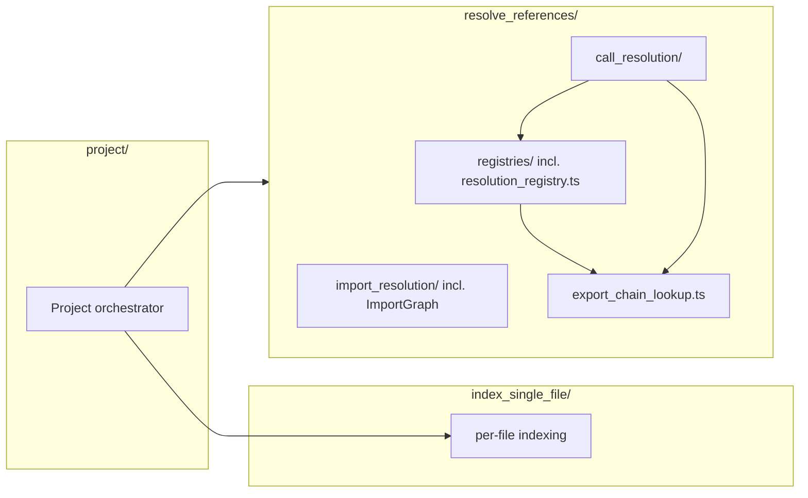
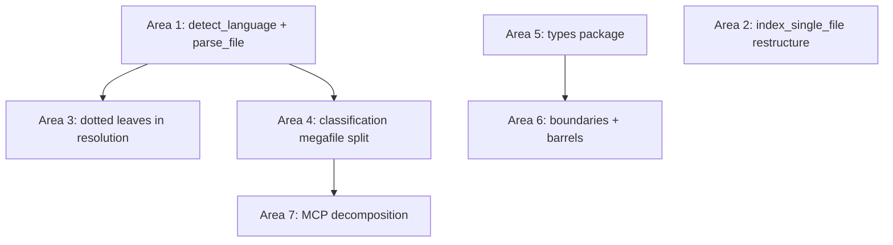

# IA Review — Refactor Program

The sizable, high-leverage restructurings that emerge from the full multi-layer IA review of `packages/core`, `packages/types`, `packages/mcp`, `packages/skill-fs`, and `packages/skill-protocol`. Every load-bearing claim below is verified against source. Small mechanical renames, moves, and deletions are consolidated in the single table at the end — they are not program areas.

The program is judged against the maintainer's two module-quality heuristics:

- **Name-accuracy**: a module is correctly sized when its name accurately describes ALL contained functionality; tiny-but-precisely-named leaves beat generic names.
- **Routing**: a maintainer reading only file/folder names must land on the right file for a given bug.

And against the repo constitution: no backwards compatibility or shims, YAGNI, every change justified against the intention tree (detect call graphs → find entry points).

## Diagnosis in one paragraph

The folder skeleton is a faithful instantiation of the three-stage intention tree — every layer-2 report independently confirms the coarse structure routes correctly. The debt concentrates at two altitudes below the folders: (1) **four megafiles** (867–1069 LOC) that hide 4–10 sub-concerns each behind a headline name, and (2) an **inconsistently applied language axis** — the dotted `{feature}.{lang}.ts` mechanism is correct and hook-enforced, but roughly a dozen files hide whole-language logic in neutral-named bodies, three folders have their language dispatch displaced into the stage orchestrator, and the single most load-bearing language function (`detect_language`) exists as three forked copies with three different unknown-extension contracts. Of twelve routing drills run against the codebase, ten fail. The program below fixes the failures without changing any mechanism the repo already enforces.

## Decisions on contested recommendations

Where lower layers disagreed, these rulings were made by reading the code:

1. **Keep dotted language files; prohibit language sub-folders and per-language top-level modules.** The dotted mechanism wins the routing test (feature-primary names), file-listing adjacency, test colocation (the file-naming hook's stacked suffix grammar — `.python.integration.test.ts` — is built for it), and the 5th-language test (add a case + a file). `index_single_file/scopes/extractors/` is not a counter-example: it is the sanctioned narrow exception for a shared cross-language base class (`JavaScriptTypeScriptScopeBoundaryExtractor` cannot wear a single language suffix), hard-coded in `.claude/hooks/file_naming.ts` (`EXTRACTOR_DIRS`). This terminal rule belongs in `file-naming.md` so it is not re-litigated.
2. **Do NOT rename `builtins/` files to snake_case and do NOT add dotted suffixes there.** Layer-1 recommended both; both are harmful. `file_naming.ts` sets `KEBAB_FILENAME_DIRS = ["builtins"]` and enforces `filename === group_id + ".ts"` with a regex that has no dot alternation — `check_….python.ts` is structurally rejected, and the filename=group_id invariant is load-bearing for `reconcile_registry.ts` row↔file mapping. The correct language mechanism in `builtins/` is language-in-the-group_id-word plus an inline `detect_language` guard.
3. **The three `detect_language` copies are NOT identical** (layer-1 said they were). They fork on the unknown-extension contract — nullable vs throwing vs silent-default-to-TypeScript. Consolidation must reconcile the contracts, not copy-paste (Area 1).
4. **MCP does NOT import core's call-graph helpers — it re-implements them** (layer-1 claimed a barrel-skip). `packages/mcp/src/tools/core/list_entrypoints.ts` defines its own `count_tree_size` (line 88) and `build_signature` (line 147, two args) against core's one-arg version (`extract_entry_point_diagnostics.ts:658`). The fix is de-duplication with signature reconciliation (Area 4).
5. **The types package keeps embedded annotated unions** — neither dotted files nor sub-folders. Union members cannot be additively contributed from separate files the way functions can. The fix is a grep-able `@language` annotation convention, not structure (Area 5).
6. **Registry `group_id` renames are out of this program.** The misleading classifier names (`framework-lifecycle-*` covering NestJS routes / yargs handlers / Node streams, `dynamic-dispatch` naming only the Webpack case, `string-keyed-dispatch` hardcoding an Angular path) are real routing failures, but each rename is a registry migration (row rename + `permanent_data.ts` regeneration + file/export/barrel rename) on the human-owned loop-closure surface governed by `.claude/rules/classifier-lifecycle.md`. They route through `reconcile-registry`, not through this refactor program.

---

## Area 1 — Language identity: one `detect_language`, one parse dispatch point

**Effort: M · Risk: low · Unlocks: 5th-language addition, pipeline-boundary hygiene, a latent-bug fix**

### Problem

`detect_language` is defined three times with three different answers to "what happens on an unknown extension" (all verified):

| Site                                                                             | Contract                                                                                                                                                       |
| -------------------------------------------------------------------------------- | -------------------------------------------------------------------------------------------------------------------------------------------------------------- |
| `packages/core/src/classify_entry_points/extract_entry_point_diagnostics.ts:718` | returns `Language \| null`; handles `.mjs`/`.cjs`; returns `null` for go/java/cpp                                                                              |
| `packages/core/src/project/project.ts:60`                                        | **throws** `Unsupported file extension`                                                                                                                        |
| `packages/core/src/trace_call_graph/trace_call_graph.ts:22`                      | **returns `"typescript"`** for anything unknown — a latent mislabel bug: an unknown-extension file reaching the trace stage is silently analyzed as TypeScript |

The canonical copy is buried at line 718 of an 867-LOC classification megafile, and **14 builtins** (`check_*.ts`) import it from there — every pipeline-support classifier carries a hard import edge into a product megafile for one utility. Additionally, `project.ts` embeds the entire parse-phase language dispatch (`get_parser` at line 81, `create_parsed_file` at line 105, all four tree-sitter grammar imports at lines 29–33) invisibly behind an orchestrator name — the worst-discoverability touch point for adding a language.

### Target structure

```
packages/core/src/
├── detect_language.ts        # detect_language(path): Language | null  (nullable core)
│                             # assert_language(path): Language          (throwing wrapper)
└── project/
    └── parse_file.ts         # tree-sitter grammar registry + get_parser + create_parsed_file
                              # — the single parse-phase dispatch point
```

### Migration

1. Create `detect_language.ts` from the canonical nullable copy; add `assert_language` as the throwing form.
2. `project/parse_file.ts`: move `get_parser`, `create_parsed_file`, and the four grammar imports out of `project.ts`; it consumes `assert_language`.
3. Update the 14 builtins and `extract_entry_point_diagnostics.ts` to import from `detect_language.ts`; delete the two private copies; `trace_call_graph.ts` uses `assert_language` (unknown extensions upstream of trace are a filtering bug and must fail loud, not default).
4. Also switch `check_py-dunder-protocol.ts` off its raw `.endsWith(".py")` to the shared function.

Three reports (indexing, classification, orchestration) independently name this the highest-leverage single fix: it kills a DRY fork, a latent mislabel bug, a cross-stage coupling magnet, and collapses the parse-phase Go touch points from three hidden switches to one routing-obvious file.

---

## Area 2 — `index_single_file/`: dissolve the type-hub orchestrator and re-home displaced dispatch

**Effort: L · Risk: medium (widest import churn in core) · Unlocks: routing inside stage 1, correct dependency direction, Go touch points**

### Problem

`index_single_file.ts` (379 LOC) has silently become three things besides an orchestrator, all verified:

- **Shared type hub**: `ProcessingContext` (L269), `CaptureNode` (L289), `SemanticEntity` (L301), `SemanticCategory` (L368) are defined in the orchestrator, and **18 files** across `capture_handlers/`, `symbol_factories/`, `scopes/`, `definitions/`, and `references/` import their fundamental wire types _upward_ from it — the dependency arrow is inverted for the whole stage.
- **Displaced language dispatch**: the `metadata_extractors` dispatch (`get_metadata_extractors`, L185) lives in the orchestrator instead of a `metadata_extractors.ts` marshaller; the `reset_*_documentation` enumeration (imports L49–51, calls L138–140) reaches two folder levels down into three `symbol_factories.{lang}.ts` leaf files by hand. A new-language author who misses the reset call ships silent cross-file doc contamination.
- Downstream, `symbol_factories.{lang}.ts` (835–993 LOC each) mix ~10 responsibilities under "factories" (ID creation, AST finders, type extraction, mutable doc-state machines, callback/collection detection); JS lacks the `imports.javascript.ts` split Python and Rust already have; and `symbol_factories.rust.ts:26` imports `DefinitionBuilder` from pass-3 `definitions/` — the stage's only pass-boundary-crossing runtime edge.

### Target structure

```
index_single_file/
├── index_single_file.ts                 # orchestrator ONLY
├── capture_types.ts                     # CaptureNode, SemanticCategory, SemanticEntity   (NEW)
├── scopes/
│   ├── processing_context.ts            # ProcessingContext — sited where it is built     (NEW)
│   └── scope_lookup.ts                  # was utils.ts (see small-items table)
├── query_code_tree/
│   ├── metadata_extractors/
│   │   ├── metadata_extractors.ts       # in-folder marshaller (moves get_metadata_extractors) (NEW)
│   │   └── metadata_extractor_types.ts  # was types.ts; live MetadataExtractors + ReceiverInfo (rename)
│   └── symbol_factories/
│       ├── documentation_state.ts       # dispatcher owning reset-per-language            (NEW)
│       ├── documentation_state.{javascript,python,rust}.ts   # doc-state machines extracted
│       ├── imports.javascript.ts        # parity with existing imports.python/rust.ts     (NEW)
│       └── test_attributes.rust.ts      # localizes the single pass-1→pass-3 edge         (NEW)
└── definitions/
    └── definition_builder.ts            # was definitions/definitions.ts (rename, table)
```

### Migration

1. Extract `capture_types.ts`; move `ProcessingContext` into `scopes/`; update the 18 upward importers in one pass (mechanical; the compiler enumerates them).
2. Add `metadata_extractors.ts` marshaller and `documentation_state.ts` dispatcher; the orchestrator calls `reset_documentation_state(language)` once instead of three hand-enumerated resets.
3. Split the doc-state machines and JS import helpers out of `symbol_factories.{lang}.ts`; extract `test_attributes.rust.ts`.
4. Delete dead types (`symbol_factories/types.ts` `SymbolCreationContext`; `metadata_extractors/types.ts` `ExtractionResult`/`NodeTraversal`/`ExtractionContext` — all zero-consumer, verified), then `git mv` the surviving `metadata_extractors/types.ts` (live `MetadataExtractors`/`ReceiverInfo`) → `metadata_extractor_types.ts` — the same banned-generic-name rule the program applies to its siblings (`capture_handlers/types.ts`, table row 20; `symbol_factories/types.ts`, deleted whole) — and complete-or-remove the vestigial `definitions/` and `symbol_factories/` barrels.

After this area, five of the ten Go touch points in stage 1 that are currently hand-enumerated in neutral files become discoverable dotted slots (the other five already route).

---

## Area 3 — Hidden language logic → dotted leaves in `resolve_references/` and `references/`

**Effort: M · Risk: low-medium · Unlocks: the call-resolution axis for a 5th language**

### Problem

The import axis is the repo's gold standard (`import_resolution.ts` dispatcher + four dotted leaves). The call-resolution axis buries the same kind of logic in neutral bodies (all verified):

- `call_resolution/path_resolution.ts` — **wholly Rust** (module doc line 1 names Rust; `PATH_ANCHORS = {crate, self, super}`; every concept is `::`/`mod`/`crate`) yet not `.rust.ts`. 87 LOC, zero content change needed.
- `call_resolution/constructor.ts` — ~120 LOC of Rust (`Self`, associated constructors, `path_prefix` gating).
- `call_resolution/function_call.ts` — Python `.endsWith(".py")` gate (L319) + ~115 LOC of Rust `::` resolution.
- `registries/export.ts:138` — Python guard + an unlabelled TS/JS arrow-function dedup block (a `export.python.ts` sibling exists; the TS/JS case has no dotted slot).
- `references/references.ts` (754 LOC) — inline TS/Python tree-sitter node-type branches inside `extract_call_site_syntax` + 4 helpers, an independently-tested analysis subsystem with no name to route to.
- `index_single_file/scopes/scopes.ts:152` — `if (file.lang === "python")` containment-sort hidden in a neutral file.

A Go implementer can enumerate the import-axis touch points from names alone but must read every call-resolution body to find these.

### Target structure

```
resolve_references/call_resolution/
├── constructor.ts                → neutral dispatch skeleton
├── constructor.rust.ts           (NEW — extracted Rust block)
├── function_call.ts              → neutral dispatch skeleton
├── function_call.rust.ts         (NEW — Rust :: path logic)
└── path_resolution.rust.ts       (git mv from path_resolution.ts — zero content change)

resolve_references/registries/
└── export.typescript.ts          (NEW — arrow-function dedup; sibling to export.python.ts)

index_single_file/references/
├── references.ts                 → capture-kind routing + ReferenceBuilder only
├── call_site_syntax.ts           (NEW — marshaller)
└── call_site_syntax.{typescript,python}.ts   (NEW — node-type branches)
```

The `scopes.ts` Python sort moves into `PythonScopeBoundaryExtractor` (`scopes/extractors/` already owns the per-language boundary behavior — the sanctioned sub-folder exception is the right home, not a new dotted file).

**Deliberately left inline** (decision): the small interwoven branches in `receiver_resolution.ts:405` (Rust impl-block scope), `type_preprocessing/member.ts:118` (Rust enum-impl), and `name_resolution.ts` (JS/Rust hoisting). At their current size the extraction machinery would exceed the routing benefit; the Go-cost argument is carried by the extractions above. Each gets a one-line `@language` comment so it is at least grep-discoverable.

### Migration

`git mv` for the pure rename; per-file extraction for the rest, moving each block plus its colocated tests in the same commit. Each extraction is independently landable. Update the fault-area map entries in `packages/types/src/ariadne_fault_area.ts` where file-precise targets move — a one-line edit each (the map is derived-not-stored by design, so renames are cheap).

---

## Area 4 — Split the classification megafile; one owner for call-graph helpers

**Effort: M · Risk: low · Unlocks: routing in stage 3, kills a cross-package divergence, cleans the pipeline boundary**

### Problem

`packages/core/src/classify_entry_points/extract_entry_point_diagnostics.ts` (867 LOC, verified) hosts under one name: the diagnostics core, the grep-index builder, syntactic-feature derivation, **JS/TS-only** definition-feature derivation (`is_jsts` gate, L582–602), an async FS-touching unindexed-test grep pass cohabiting a zero-I/O sync core, plus three unrelated utilities — `detect_language` (leaves in Area 1), `build_signature` (L658), `count_tree_size` (L694). Meanwhile `packages/mcp/src/tools/core/list_entrypoints.ts` **re-implements** `count_tree_size` (L88) and `build_signature` (L147) — and the two `build_signature`s have already diverged on arity and return type. Nothing here routes: "accessor detection wrong on a getter" and "unindexed-test grep misses a file" both land in this one file by archaeology only.

### Target structure

```
classify_entry_points/
├── extract_entry_point_diagnostics.ts    # diagnosis core + grep-index build only
├── derive_syntactic_features.ts          (NEW)
├── derive_definition_features.ts         (NEW — neutral marshaller)
├── derive_definition_features.jsts.ts    (NEW — the one legitimate dotted case in this stage)
└── attach_unindexed_test_grep_hits.ts    (NEW — isolates the async/FS lifecycle)

trace_call_graph/
├── count_tree_size.ts                    (NEW — call-graph metric, owned by the stage that owns CallGraph)
└── build_signature.ts                    (NEW — reconciled single signature)
```

MCP deletes its local copies and imports both helpers from `@ariadnejs/core` (they are call-graph concerns, not classification concerns; MCP's `show_call_graph_neighborhood.ts` currently imports `build_signature` from a _sibling tool_, which this also fixes).

### Migration

Split file-by-file with tests following; reconcile the `build_signature` contract (decide the one signature both consumers need — MCP's optional-location variant subsumes core's); update the 14-builtin import path (already done in Area 1); regenerate nothing (no registry contact).

---

## Area 5 — `packages/types`: delete the dead island, split the stage-straddlers, reconcile `Resolution`

**Effort: L · Risk: low (mechanical churn, compiler-guided) · Unlocks: an honest shared vocabulary; removes ~450 LOC of dead public API**

### Problem

All verified:

- **Dead island**: `codegraph.ts`, `calls.ts`, `classes.ts`, `false_positive_results.ts`, `immutable.ts`, `type_kind.ts` have zero consumers outside the types package — kept alive only by mutual intra-package reference and the barrel (grep re-confirmed: only `types/src/index.ts` and other island members import them). `aliases.ts` (`// TODO: remove all of these`) is coupled to live code only via `DocString` in `symbol_definitions.ts`. `false_positive_results.ts` is a stale duplicate of the triage wire schema now owned by `packages/skill-protocol/src/triage_results.ts` — deletion, not rename.
- **Name collision behind a leaky barrel**: `query.ts:83` `Resolution<T>` vs `symbol_references.ts:315` `Resolution` (and two `ResolutionConfidence`s); the barrel hides the collision by silently omitting `query.ts`'s exports, which have zero production callers.
- **Stage-straddling / stage-named files**: `call_chains.ts` mixes call-graph structure with resolution-failure diagnostics; `symbol_references.ts` mixes stage-1 reference inputs with stage-2 resolution outputs; `index_single_file.ts` is named after a pipeline stage while holding `LexicalScope`/`TypeInfo`/`TypeMemberInfo`/`ReferenceType` whose main consumers are in `resolve_references/`; `common.ts` is a catch-all (spatial primitives + member-info types parked to break a cycle).
- **`SemanticIndex` lives in stage-1 internals**: it is the persisted contract, composed entirely of types-package types (verified: `FilePath`, `Language`, `ScopeId`, `LexicalScope`, the definition maps, `SymbolReference`), yet `persistence/serialize_index.ts` and `registries/type.ts` must reach into `index_single_file/index_single_file.ts` for it.

### Target structure

```
types/src/
├── location.ts               # Location, FilePath, Language, LocationKey   (from common.ts)
├── member_info.ts            # LocalMemberInfo, LocalParameterInfo         (from common.ts)
├── lexical_scope.ts          # LexicalScope                                (from index_single_file.ts)
├── type_member_info.ts       # TypeInfo, TypeMemberInfo                    (from index_single_file.ts)
├── reference_type.ts         # ReferenceType                               (from index_single_file.ts)
├── semantic_index.ts         # SemanticIndex                               (moved from core stage-1)
├── call_graph.ts             # CallGraph, CallableNode, CallReference, …   (from call_chains.ts)
├── resolution_failure.ts     # ResolutionFailure*, CallSiteSyntax, ReceiverKind (from call_chains.ts)
├── resolution.ts             # Resolution, ResolutionConfidence, ResolutionReason (from symbol_references.ts)
└── …                         # symbol_references.ts keeps only the reference variants + guards
```

Deleted: the seven dead-island files and `query.ts`'s resolution layer (`Resolution<T>`, `is_resolution`, `resolve_*` factories — zero production callers), which dissolves the collision and the barrel's hand-maintained omission list; the barrel returns to uniform `export *`.

### Migration

1. Migrate `DocString` off `aliases.ts` (inline the alias into `symbol_definitions.ts`), then delete the island in one commit — the compiler proves nothing outside the package breaks.
2. `git mv`-shaped splits for the live files; update importers across core/mcp/skills (mechanical, compiler-guided).
3. Move `SemanticIndex` to `types/src/semantic_index.ts`; `index_single_file.ts`, `serialize_index.ts`, and `registries/type.ts` import it from `@ariadnejs/types` — this removes the two genuine cross-stage type imports flagged in the support and resolution reports.
4. Adopt the `@language` doc-tag convention on every language-specific union member (`ReceiverKind.type_cast` TS, `dunder_protocol` Python, `path_prefix` Rust, …) and mark `type_id.ts`'s silently JS/TS-only scope.

---

## Area 6 — Stage boundaries and barrels: make ownership match the pipeline order

**Effort: M · Risk: medium (touches the resolution hot path) · Unlocks: an enforceable stage order; ends ownership blur at the public surface**

### Problem

Four verified boundary violations plus a barrel layer that misrepresents ownership:

1. **Layering inversion**: `resolve_references/registries/type.ts:20` value-imports `resolve_namespace_export` from `../call_resolution/method_lookup` — a data store depending on the call-resolution logic layer, a soft cycle saved only by TS value-load timing. The function is an export-chain utility with 3 callers, misplaced in `method_lookup.ts`.
2. **Cross-stage value import**: `call_resolution/call_resolver.ts:44` imports `find_enclosing_function_scope` from stage-1 `index_single_file/scopes/utils` — a pure scope-tree walk with no indexing concern.
3. **Stage-order inversion**: `project/import_graph.ts` value-imports `resolve_module_path`/`resolve_submodule_import_path` from `resolve_references/import_resolution` — a stage-2-coordinator data structure embedding stage-2-resolution logic while living in `project/`. The class also caches resolved paths, so it _is_ a resolution-time artifact.
4. **Misnamed store**: `resolve_references/resolve_references.ts` holds `class ResolutionRegistry` (verified) — a store wearing the folder's logic name; stale dist fossils (`resolution_registry.d.ts/.js`) confirm a reverted rename.
5. **Barrels**: `project/index.ts` (verified, quoted below) re-exports five registries _from `resolve_references/`_ — they appear to belong to `project/` — while omitting `load_project`, `is_test_file`, and every `file_loading` symbol, forcing `core/index.ts` to bypass into four deep paths. `resolve_references/index.ts` is a zero-export doc-only file whose comment claims "call resolution functionality". `persistence/index.ts` is bypassed by every internal consumer.

```ts
// packages/core/src/project/index.ts — the entire file today
export { DefinitionRegistry } from "../resolve_references/registries/definition";
export { TypeRegistry } from "../resolve_references/registries/type";
export { ScopeRegistry } from "../resolve_references/registries/scope";
export { ExportRegistry } from "../resolve_references/registries/export";
export { ImportGraph } from "./import_graph";
export { ResolutionRegistry } from "../resolve_references/resolve_references";
export { Project } from "./project";
```

### Target



- New `resolve_references/export_chain_lookup.ts` owns `resolve_namespace_export` (+ `resolve_named_import`); `registries/type.ts`, `constructor.ts`, and `method_lookup.ts` consume it. One move fixes the inversion AND `method_lookup.ts`'s name-accuracy.
- `find_enclosing_function_scope` moves to `registries/scope.ts` (it walks the scope store).
- `ImportGraph` moves to `resolve_references/import_resolution/` (`git mv`); `project/` (the orchestrator) may depend on stages, a stage may not depend on a later one — this ruling resolves the inversion the orchestration report flagged without prescription.
- `git mv resolve_references.ts → resolution_registry.ts`; delete the stale dist fossils.
- Barrels: `project/index.ts` exports only project's own surface (`Project`, `load_project`, `is_test_file`, `ClassifyOptions`, `file_loading` symbols); `resolve_references/index.ts` becomes the real stage-2 barrel (five registries + `ResolutionRegistry`); `core/index.ts` re-points to sub-barrels everywhere (including the seven verified unnecessary deep-path bypasses) and consumers route through `persistence/index.ts` for consistency with the sibling `introspection`/`profiling`/`logging` barrels.

### Migration

Land the two utility moves first (compiler-guided), then the `ImportGraph` move, then the rename, then the barrel repair in a single closing commit. Depends on Area 5 only for the `SemanticIndex` import cleanup in `registries/type.ts`.

---

## Area 7 — MCP package: separate boot from logic, split the two four-responsibility tools

**Effort: M · Risk: low · Unlocks: testable CLI parsing, per-concern routing in the agent-facing tools**

### Problem

All verified:

- `packages/mcp/src/server.ts` parses CLI args and then **boots a live server at module scope** (`start_server(...).catch(console.error)`, L94–100); importing it to test the three pure functions starts a server. The real composition root is `start_server.ts` — a naming inversion.
- `tools/core/list_entrypoints.ts` (463 LOC) bundles schema/config, tree metrics, signature formatting, and suppressed-entry rendering; `tools/core/show_call_graph_neighborhood.ts` (620 LOC) bundles schema, symbol-ref parsing, bidirectional traversal, and ASCII rendering. Neither routes per-concern ("symbol_ref parsing fails on Windows paths" does not land anywhere by name).
- `analytics/analytics.ts` is a folder-name tautology (forbidden by `file-naming.md`) and its write-side `ToolCallRecord` has no compiler link to the read-side `ToolCallRow` in `query_stats.ts` — a write-schema change silently breaks the reader.

### Target structure

```
mcp/src/
├── cli.ts                    # bin entry: parse + boot only            (from server.ts)
├── cli_args.ts               # pure parse_cli_args/resolve_* exports   (from server.ts)
├── server.ts                 # the composition root                    (git mv from start_server.ts)
├── analytics/
│   ├── analytics_config.ts   # shared ToolCallRecord + is_analytics_enabled + resolve_analytics_dir
│   ├── session_writer.ts     # write side (from analytics.ts)
│   └── query_stats.ts        # read side, consumes analytics_config
└── tools/core/
    ├── list_entrypoints.ts             # tool + metric only; imports count_tree_size/build_signature from @ariadnejs/core (Area 4)
    ├── format_suppressed.ts            # classification-tag + suppressed-section rendering (the one 5th-language touch point in the periphery)
    ├── show_call_graph_neighborhood.ts # tool + renderer
    ├── resolve_symbol_ref.ts           # parse_symbol_ref, paths_match, find_node_by_symbol_ref
    └── traverse_call_graph.ts          # build_callers_index, traverse_callees/callers
```

### Migration

Pure splits plus one `git mv`; update `package.json` `bin` to `cli.ts`. Depends on Area 4 for the shared helpers. Delete the local `count_tree_size`/`build_signature` copies in the same commit that switches the imports.

---

## Ordering



Areas 1, 2, and 5 are independent starting points. Area 1 first — smallest blast radius, highest citation count across reports, and it unblocks the language-guard cleanups in Areas 3 and 4. Area 2 is the widest churn and can proceed in parallel. Within each area, land everything at once per the no-shims constitution: update all callers, no re-exports, no transitional aliases; use `git mv` for every rename so history survives.

## Out of scope (cut as speculative or not-this-program)

- **Registry `group_id` migrations** — routed to the human-owned `reconcile-registry` flow (Decision 6).
- **`profiler.ts` hierarchical-timer split** — the support report itself rates it not-urgent under YAGNI; only the shared stage-label constant lands (table).
- **`import_graph.ts` internal cache split** — the relocation (Area 6) is sufficient; a `resolved_import_cache.ts` split is speculative.
- **Classifier-authoring scaffolding, a classifier-observable subset type, wiring `explain_call_site` into MCP** — pipeline-capability work, not IA restructuring; the pipeline-augmentation report holds them, and only the `explain_call_site` wire-or-delete _decision_ appears in the table because dead public API is an IA concern.
- **`ProjectManager` watch-wiring split** — watch, do not split, at 149 LOC.

## Consolidated small items

Mechanical renames, moves, deletions, and one-line fixes. Each is verified; none needs a design decision beyond what is stated. Paths relative to repo root, `packages/` elided where unambiguous.

| #   | Item                                                                                     | Action                                                                                                                                                                                                                                                         |
| --- | ---------------------------------------------------------------------------------------- | -------------------------------------------------------------------------------------------------------------------------------------------------------------------------------------------------------------------------------------------------------------- |
| 1   | `core/src/project/extract_nested_definitions.ts`                                         | `git mv` → `extract_parameters.ts` (exports only `extract_all_parameters`; extracts only parameters)                                                                                                                                                           |
| 2   | `core/src/classify_entry_points/classify_entry_points.ts`                                | `git mv` → `auto_classify.ts` (it is the registry-walk sub-step; `enrich_call_graph.ts` is the stage face)                                                                                                                                                     |
| 3   | `core/src/index_single_file/definitions/definitions.ts`                                  | `git mv` → `definition_builder.ts` (holds `DefinitionBuilder`); group the 4 Rust-only + 1 Python-only methods under labelled sections                                                                                                                          |
| 4   | `core/src/index_single_file/scopes/utils.ts`                                             | `git mv` → `scope_lookup.ts` (banned generic name); dedupe `find_root_scope` and the location-geometry predicates duplicated with `scopes.ts`                                                                                                                  |
| 5   | `core/src/introspection/`                                                                | rename folder → `project_queries/` (stance word, not a concern)                                                                                                                                                                                                |
| 6   | `core/src/introspection/list_name_collisions.ts`                                         | delete (4-line pass-through, zero production consumers)                                                                                                                                                                                                        |
| 7   | `explain_call_site`                                                                      | decide: wire into the MCP `core` tool group (its designed consumer) or delete per YAGNI — currently zero consumers                                                                                                                                             |
| 8   | `core/src/resolve_references/file_folders.ts` `is_python_file`                           | move into `registries/export.python.ts` (sole caller is `registries/export.ts`)                                                                                                                                                                                |
| 9   | `core/src/resolve_references/file_folders_test_helper.ts`                                | rename → `resolution_test_helpers.ts` (builds full export-chain contexts, not FS fixtures)                                                                                                                                                                     |
| 10  | `core/src/resolve_references/type_preprocessing/constructor.ts`                          | rename → `constructor_bindings.ts` (collides with `call_resolution/constructor.ts`; export is `extract_constructor_bindings`)                                                                                                                                  |
| 11  | `core/src/resolve_references/registries/definition.ts` `scope_to_definitions_index`      | delete (~30 LOC built and maintained, no getter, no reader)                                                                                                                                                                                                    |
| 12  | `call_resolution/constructor.ts` `find_class_definition` / `find_associated_constructor` | drop `export` (in-file use only)                                                                                                                                                                                                                               |
| 13  | `type_preprocessing/member.ts:27–28`                                                     | delete orphaned JSDoc for a removed function                                                                                                                                                                                                                   |
| 14  | `import_resolution/index.ts`                                                             | trim to `resolve_module_path` + `resolve_submodule_import_path` (four surplus language re-exports)                                                                                                                                                             |
| 15  | `import_resolution.rust.ts` private `file_exists`                                        | replace with shared `has_file_in_tree` used by the other three language files                                                                                                                                                                                  |
| 16  | `core/src/classify_entry_points/registry_permanent.ts`                                   | delete (22-LOC field-unwrap shim); `registry_loader.ts` reads `PERMANENT_REGISTRY_FILE.rules`/`.schema_version` directly                                                                                                                                       |
| 17  | `core/src/classify_entry_points/permanent_data.ts`                                       | rename → `registry_permanent_data.ts` (update `generate_permanent_data.ts` output path + sync test)                                                                                                                                                            |
| 18  | `builtins/check_framework-lifecycle-override.ts`                                         | **correctness**: gate is `=== "typescript"` but the documented intent is TS/JS — widen to include `javascript` (JS stream `_transform`/`_flush` subclasses currently never classify); a direct code edit, not a registry change — see the note below the table |
| 19  | `builtins/check_string-keyed-dispatch.ts`                                                | **correctness flag**: hardcodes `new RegExp('/packages/core/src/')` — an Angular project's internal path in a universal builtin; fix via the registry flow                                                                                                     |
| 20  | `core/src/index_single_file/query_code_tree/capture_handlers/types.ts`                   | rename → `handler_types.ts`                                                                                                                                                                                                                                    |
| 21  | `capture_handlers/loop_variable_handlers.python.ts`                                      | rename → `control_flow_variable_handlers.python.ts` (also handles `except…as`, `with…as`)                                                                                                                                                                      |
| 22  | `core/src/index_single_file/query_code_tree/query_loader.ts`                             | split static parser registry (`LANGUAGE_TO_TREESITTER_LANG`, `SUPPORTED_LANGUAGES`) → `parsers.ts`; delete the five stale `semantic_index/queries/` fallback paths                                                                                             |
| 23  | `core/src/profiling` stage labels                                                        | export the five pipeline-stage labels as one shared const; consume in `project.ts`, `index_single_file.ts`, and the `update_file_timing` switch (rename currently silently zeroes timing fields)                                                               |
| 24  | `profiling/index.ts` `TimingEntry`/`FileTimingEntry`                                     | drop from barrel (no external importer); rename type `FileTimingEntry` → `FilePipelineTimingEntry`                                                                                                                                                             |
| 25  | `core/src/persistence` save-path duplication                                             | single owner for `content_hash` + index/manifest writes (today both `project.ts::save()` and `load_project.ts`); extract `project_cache_strategy.ts` from `load_project.ts` (`can_use_cache`, `try_restore_from_cache`, manifest lifecycle)                    |
| 26  | `skill-fs/src/classifier_regressions.ts`                                                 | move `aggregate_classifier_regressions` + its input type into `.claude/skills/triage/src/finalize/` (sole caller); drop the dead `ClassifierRegression*` re-exports from file and barrel                                                                       |
| 27  | `skill-fs/src/errors.ts`                                                                 | rename → `node_error_code.ts` (holds one function, `error_code`)                                                                                                                                                                                               |
| 28  | `mcp/src/tools/tool_registry.ts`                                                         | rename → `register_tools.ts` (one-shot registration, not a lookup table); one-line doc for the embedded `record_tool_call` analytics edge                                                                                                                      |
| 29  | `.claude/skills/plan/src/store/paths.ts` `get_repo_root`                                 | delete; import `repo_root` from `@ariadnejs/skill-protocol` (hard-coded `../../../../..` depth vs the robust workspace-file walk)                                                                                                                              |
| 30  | `types/src/type_id.ts` `@deprecated Use TypeName instead`                                | delete the marker (`TypeName` does not exist)                                                                                                                                                                                                                  |
| 31  | `types/src/entry_point.ts` `SyntacticFeatures.is_inside_try`                             | delete (permanently `false`, never surfaced by core; update triage fixtures)                                                                                                                                                                                   |
| 32  | `.claude/rules/trace-call-graph.md`                                                      | rewrite to match reality (documents `filter_entry_points.ts`/`.python.ts`, neither exists; the behavior lives in `classify_entry_points/`)                                                                                                                     |
| 33  | `.claude/rules/file-naming.md`                                                           | record the terminal language-mechanism rule: dotted suffix is the default; `extractors/`-style prefix sub-folders only for shared-base hierarchies; language sub-folders and per-language top-level modules are prohibited; `builtins/` uses filename=group_id |
| 34  | `classify_entry_points/builtins/index.ts`                                                | add the one-paragraph placement rationale: checks run against `EnrichedEntryPoint` inside `enrich_call_graph`, a core-internal structure that does not cross the skill boundary — so the classifier lives where its input lives                                |
| 35  | `dist/resolve_references/resolution_registry.*`                                          | delete stale build fossils (Area 6 rename makes them current again — verify clean rebuild)                                                                                                                                                                     |
| 36  | `detect_test_file.typescript.ts` / `.javascript.ts`                                      | extract shared `TEST_DIR_PATTERNS` const (~60% verbatim duplication) without collapsing the correct language split                                                                                                                                             |

**Note on rows 18 and 19 — why one is a code edit and the other routes through the registry.** `check_*.ts` bodies are ordinary agent-editable repo code per classifier-lifecycle's hand-off step 1: no renderer regenerates them (the `classifier-author` agent authors each file once; `reconcile_registry.ts` renders only `permanent_data.ts`), and row 18 leaves the registry row (`function_name`, `min_confidence`, `group_id`) unchanged — it aligns the gate with the intent the rule already documents, so Decision 6 does not apply. The same commit reconciles the file's stale `Do not edit by hand` provenance header with this contract. Row 19's fix redefines the rule's match pattern — a registry decision on the human-owned loop-closure surface — so it routes through the `reconcile-registry` flow per Decision 6.
