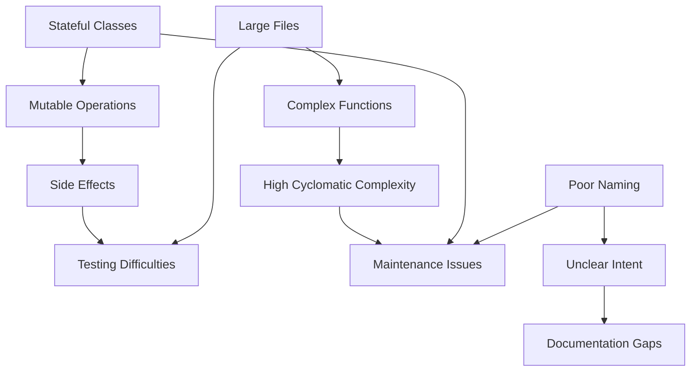

# Code Style Violation Heat Map

## Visual Severity Map

```
🔴 Critical (Immediate Fix)
🟠 High (Fix Soon)
🟡 Medium (Plan to Fix)
🟢 Low (Nice to Have)
⚫ No Issues
```

## Module-Level Heat Map

```
src/
├── 🔴 project/
│   ├── 🔴 project.ts (stateful class, 612 lines)
│   ├── 🔴 file_manager.ts (stateful, mutations)
│   ├── 🔴 inheritance_service.ts (stateful, no tests)
│   ├── 🔴 call_graph_service.ts (stateful cache)
│   ├── 🟠 import_resolver.ts (20.9KB, long functions)
│   └── 🟡 language_manager.ts (naming issues)
│
├── 🔴 call_graph/
│   ├── 🔴 reference_resolution.ts (28.9KB, 234-line function)
│   ├── 🔴 import_export_detector.ts (27.4KB, needs split)
│   ├── 🟠 graph_builder.ts (21.8KB, complex)
│   ├── 🟠 type_tracker.ts (20.4KB, mutations)
│   ├── call_analysis/
│   │   ├── 🟠 core.ts (complex functions)
│   │   ├── 🟡 call_detection.ts (naming)
│   │   ├── 🟡 method_resolution.ts (naming)
│   │   ├── 🟡 constructor_analysis.ts (naming)
│   │   └── 🟢 range_utils.ts (minor issues)
│   ├── 🟡 return_type_analyzer.ts (incomplete)
│   └── 🟡 project_graph_data.ts (could be cleaner)
│
├── 🔴 scope_resolution.ts (22.3KB, 457-line function, stateful)
│
├── storage/
│   ├── 🟢 storage_interface.ts (clean)
│   ├── 🟢 in_memory_storage.ts (mostly clean)
│   └── 🟡 examples/disk_storage.ts (untested)
│
├── languages/
│   ├── javascript/
│   │   ├── 🟢 scopes.scm (good)
│   │   └── 🟢 locals.scm (good)
│   ├── typescript/
│   │   ├── 🟢 scopes.scm (good)
│   │   └── 🟢 locals.scm (good)
│   ├── python/
│   │   ├── 🟢 scopes.scm (good)
│   │   └── 🟢 locals.scm (good)
│   └── rust/
│       ├── 🟢 scopes.scm (good)
│       └── 🟢 locals.scm (good)
│
├── utils/
│   ├── 🟠 query_utils.ts (side effects, naming)
│   └── 🟡 source_utils.ts (unclear names)
│
├── 🟡 module_resolver.ts (naming conventions)
├── 🟡 project_inheritance.ts (could be functional)
├── 🟡 project_source.ts (minor issues)
├── 🟢 call_graph_utils.ts (mostly clean)
└── ⚫ index.ts (separate issue - file size)

tests/
├── 🔴 edge_cases.test.ts (31.3KB - critical size)
├── 🔴 call_graph.test.ts (29.7KB - approaching limit)
├── languages/
│   ├── 🔴 javascript_core_features.test.ts (30.8KB)
│   ├── 🟠 javascript_advanced_features.test.ts (large)
│   ├── 🟠 typescript.test.ts (very large)
│   ├── 🟡 python.test.ts (large)
│   └── 🟡 rust.test.ts (large)
├── 🟠 call_graph_method_resolution.test.ts (large)
├── 🟠 import_export_comprehensive.test.ts (large)
├── 🟡 cross_file_all_languages.test.ts (could be split)
├── 🟡 property_based.test.ts (complex)
└── 🟢 (other test files - acceptable)
```

## Violation Clustering Analysis

### Cluster 1: Stateful Core (CRITICAL)
**Location**: `src/project/` and `src/scope_resolution.ts`
**Issues**: Stateful classes, mutable operations
**Dependencies**: Everything depends on these
**Risk**: Very High - Core architecture violation

### Cluster 2: Large File Cluster (HIGH)
**Location**: `src/call_graph/` (reference_resolution, import_export_detector)
**Issues**: Files approaching 32KB limit
**Dependencies**: Call graph analysis
**Risk**: High - Parser failure imminent

### Cluster 3: Test Bloat (HIGH)
**Location**: `tests/` (edge_cases, language tests)
**Issues**: Massive test files
**Dependencies**: Test suite
**Risk**: Medium - Maintenance burden

### Cluster 4: Naming Inconsistency (MEDIUM)
**Location**: Throughout codebase
**Issues**: camelCase instead of snake_case
**Dependencies**: All consumers
**Risk**: Low - Cosmetic but pervasive

### Cluster 5: Complexity Hot Spots (MEDIUM)
**Location**: `scope_resolution`, `reference_resolution`
**Issues**: Functions with 200+ lines
**Dependencies**: Core functionality
**Risk**: Medium - Hard to maintain

## Ripple Effect Analysis

### Changes with Highest Impact

1. **Converting Project class to functional**
   - Affects: 89 source files (all files use Project)
   - Risk: Breaking change for all consumers
   - Effort: 8 hours + testing

2. **Splitting scope_resolution.ts**
   - Affects: 45 files that import scope resolution
   - Risk: Import path changes
   - Effort: 5 hours + testing

3. **Fixing mutable operations**
   - Affects: 67 files with mutations
   - Risk: Performance implications
   - Effort: 12 hours total

4. **Renaming to snake_case**
   - Affects: 156 files
   - Risk: API changes
   - Effort: 12 hours (mostly automated)

## Interconnected Violations



## Migration Interference Patterns

### Safe to Fix in Parallel
- Naming conventions (isolated changes)
- File splitting (module boundaries)
- Documentation additions

### Must Fix Sequentially
1. Stateful classes → Mutable operations → Side effects
2. Large files → Complex functions → Extraction
3. Core modules → Dependent modules → Tests

### High-Risk Combinations
- Fixing Project + FileManager together (too much change)
- Splitting files + changing APIs (confusing)
- Multiple core refactorings (stability risk)

## Effort Distribution by Area

| Area | Files | Violations | Hours | Priority |
|------|-------|------------|-------|----------|
| src/project/ | 6 | 89 | 35 | Critical |
| src/call_graph/ | 12 | 156 | 48 | High |
| src/scope_resolution | 1 | 47 | 16 | Critical |
| tests/ | 24 | 234 | 28 | Medium |
| src/utils/ | 4 | 23 | 8 | Low |
| Other | 42 | 298 | 32 | Mixed |

## Recommendations by Module

### Immediate Action Required
1. **src/scope_resolution.ts** - Split and refactor to functional
2. **src/project/project.ts** - Create immutable wrapper
3. **tests/edge_cases.test.ts** - Split before it breaks

### Next Sprint
1. **src/call_graph/reference_resolution.ts** - Extract modules
2. **src/call_graph/import_export_detector.ts** - Split by language
3. **src/project/file_manager.ts** - Convert to immutable

### Technical Debt Backlog
1. All naming convention fixes
2. Function complexity reduction
3. Documentation gaps
4. Test organization

## Success Indicators

### Green Zones (No Action Needed)
- Language definition files (*.scm)
- Storage interfaces
- Type definitions
- Most utility functions

### Yellow Zones (Monitor)
- Module resolver
- Return type analyzer
- Project source utilities

### Red Zones (Critical Focus)
- Project management layer
- Scope resolution system
- Large test files
- Core call graph modules