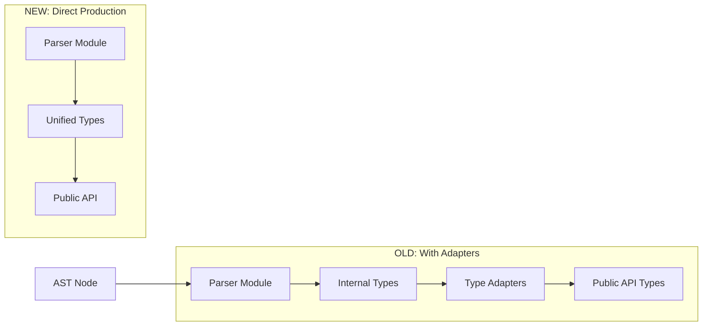

# Type Adapter Elimination Overview

## Executive Summary

Tasks 11.100.0.5.14-18 eliminate the entire type adapter layer by having AST parsing modules directly produce unified types, removing ~200 lines of unnecessary conversion code.

## Problem Statement

The codebase currently has duplicate type definitions and adapter functions:

1. **Import/Export Duplication**:
   - `ImportInfo` → `ImportStatement` (via adapter)
   - `ExportInfo` → `ExportStatement` (via adapter)

2. **Type Tracking Duplication**:
   - Internal `TypeInfo[]` → Public `TypeInfo` (via complex adapter)

3. **Adapter Functions** in `type_adapters.ts`:
   - `convert_import_info_to_statement()`
   - `convert_export_info_to_statement()`
   - `convert_type_info_array_to_single()`
   - `convert_type_map_to_public()`
   - `convert_imports_to_statements()`
   - `convert_exports_to_statements()`

## Solution Architecture



## Task Breakdown

### Task 14: Migrate import_resolution to UnifiedImport
- **Status**: To Do
- **Impact**: Eliminates ImportInfo and its adapter
- **Modules**: All import_resolution language variants
- **Output**: Direct UnifiedImport[] production

### Task 15: Migrate export_detection to UnifiedExport  
- **Status**: To Do
- **Impact**: Eliminates ExportInfo and its adapter
- **Modules**: All export_detection language variants
- **Output**: Direct UnifiedExport[] production

### Task 16: Migrate type_tracking to TrackedType
- **Status**: To Do
- **Impact**: Eliminates TypeInfo arrays and complex conversion
- **Modules**: All type_tracking language variants
- **Output**: Map<SymbolId, TrackedType> instead of Map<string, TypeInfo[]>

### Task 17: Update file_analyzer
- **Status**: To Do
- **Dependencies**: Tasks 14-16
- **Impact**: Removes all adapter imports and calls
- **Output**: Direct unified type usage in FileAnalysis

### Task 18: Delete type_adapters
- **Status**: To Do
- **Dependencies**: Task 17
- **Impact**: Removes ~200 lines of obsolete code
- **Output**: Clean architecture with no adapter layer

## Benefits

1. **Code Reduction**: ~200 lines of adapter code eliminated
2. **Type Safety**: Single source of truth for each type
3. **Performance**: No intermediate conversions
4. **Maintainability**: Changes in one place, not multiple
5. **Clarity**: Direct AST → API mapping

## Implementation Order

```
1. Tasks 14-16 can be done in parallel (no dependencies between them)
2. Task 17 depends on all three being complete
3. Task 18 is final cleanup after 17
```

## Success Criteria

- All AST parsing modules produce unified types directly
- No type adapter functions remain
- FileAnalysis uses unified types throughout
- All tests pass with new architecture
- TypeScript compilation succeeds

## Risk Mitigation

- Each task is isolated to specific modules
- Tests verify behavior at each step
- Can be rolled back module by module if issues arise
- Unified types already tested in tasks 1-13

## Timeline Estimate

- Tasks 14-16: 2-3 hours each (parallel work possible)
- Task 17: 1-2 hours (integration)
- Task 18: 30 minutes (cleanup)
- Total: ~4-6 hours of focused work