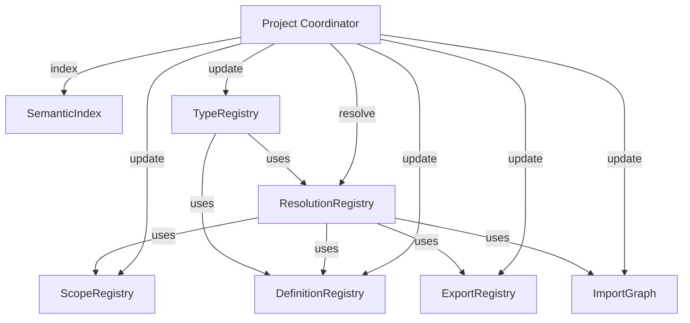
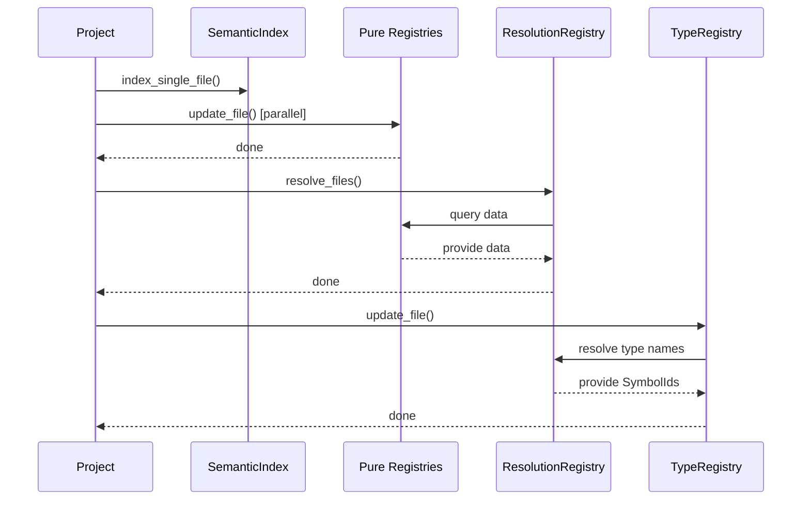

# Task: Document Registry Pattern and Architecture

**Epic**: Epic 11 - Codebase Restructuring
**Parent Task**: task-epic-11.144 - Merge TypeContext into TypeRegistry
**Status**: Not Started
**Priority**: Medium
**Complexity**: Low

## Overview

Document the registry pattern established through Epic 11.144, update CLAUDE.md with architectural guidelines, and optionally create a TypeScript interface for registries.

## Context

Through Epic 11.144, we've established a consistent **registry pattern** that all registries follow:
- DefinitionRegistry
- TypeRegistry
- ScopeRegistry
- ExportRegistry
- ImportGraph
- ResolutionRegistry

This pattern should be documented so future registries follow the same conventions.

## Goals

1. Document registry pattern in CLAUDE.md
2. Add architectural diagrams showing dependencies
3. Optionally create TypeScript interface for registries
4. Document update order and dependencies
5. Provide examples for future registry implementations

## Implementation

### 1. Update CLAUDE.md

Add comprehensive registry pattern documentation:

```markdown
## Registry Architecture Pattern

### Overview

Registries are the core data structures that maintain project state. Each registry is responsible for a specific aspect of the codebase (definitions, types, scopes, etc.).

### Registry Pattern

All registries follow this pattern:

```typescript
interface Registry {
  /**
   * Update a file with new data.
   * Performs all necessary processing including resolution.
   * Must be idempotent (calling multiple times with same data = same result).
   */
  update_file(file_id: FilePath, ...dependencies): void;

  /**
   * Remove all data for a file.
   * Must clean up all internal storage.
   */
  remove_file(file_id: FilePath): void;

  /**
   * Clear all data from the registry.
   * Used when resetting the project.
   */
  clear(): void;

  /**
   * Optional: Get statistics about registry state.
   * Useful for debugging and monitoring.
   */
  get_stats?(): RegistryStats;
}
```

### Registry Categories

#### Pure Registries (No Cross-Registry Dependencies)

These registries only need the semantic index to update:

- **DefinitionRegistry**: Stores all definitions (functions, classes, variables, etc.)
- **ScopeRegistry**: Stores scope tree and scope relationships
- **ExportRegistry**: Stores export statements and exported symbols
- **ImportGraph**: Stores import relationships and dependencies

**Pattern:**
```typescript
class PureRegistry {
  update_file(file_id: FilePath, index: SemanticIndex): void {
    // Extract data from index
    // Store in internal maps
    // No cross-registry lookups needed
  }
}
```

#### Resolution-Dependent Registries

These registries need resolved references to function properly:

- **TypeRegistry**: Stores type information (needs ResolutionRegistry to resolve type names)

**Pattern:**
```typescript
class TypeRegistry {
  update_file(
    file_id: FilePath,
    index: SemanticIndex,
    definitions: DefinitionRegistry,
    resolutions: ResolutionRegistry
  ): void {
    // Phase 1: Extract raw data (names)
    const type_data = extract_type_data(index);

    // Phase 2: Resolve names to SymbolIds
    this.resolve_type_metadata(file_id, type_data, definitions, resolutions);

    // Phase 3: Store resolved data
  }
}
```

#### Resolution Registry (Special)

The ResolutionRegistry is unique - it needs ALL other registries to perform resolution:

```typescript
class ResolutionRegistry {
  resolve_files(
    file_ids: Set<FilePath>,
    semantic_indexes: ReadonlyMap<FilePath, SemanticIndex>,
    definitions: DefinitionRegistry,
    types: TypeRegistry,
    scopes: ScopeRegistry,
    exports: ExportRegistry,
    imports: ImportGraph,
    root_folder: FileSystemFolder
  ): void {
    // Resolve all references in the files
    // Uses all registries to perform resolution
  }
}
```

### Update Order in Project

The order of updates matters due to dependencies:

```typescript
// In Project.update_file()

// Phase 1: Index the file
const index = index_single_file(file_id, content, language);

// Phase 2: Update pure registries (parallel safe, no dependencies)
definitions.update_file(file_id, index);
scopes.update_file(file_id, index);
exports.update_file(file_id, index);
imports.update_file(file_id, import_data);

// Phase 3: Resolve references (needs all pure registries)
const affected_files = new Set([file_id, ...dependents]);
resolutions.resolve_files(
  affected_files,
  semantic_indexes,
  definitions,
  types,  // Needs raw type data for export metadata
  scopes,
  exports,
  imports,
  root_folder
);

// Phase 4: Update resolution-dependent registries
for (const affected_file of affected_files) {
  const affected_index = semantic_indexes.get(affected_file);
  types.update_file(affected_file, affected_index, definitions, resolutions);
}
```

### Dependency Graph

```
Pure Registries
├── DefinitionRegistry
├── ScopeRegistry
├── ExportRegistry
└── ImportGraph
      ↓
ResolutionRegistry (depends on all above)
      ↓
Resolution-Dependent Registries
└── TypeRegistry (depends on ResolutionRegistry)
```

### Adding a New Registry

When adding a new registry, follow this checklist:

1. **Determine Category**: Is it pure or resolution-dependent?
2. **Implement Methods**:
   - `update_file()` - Main entry point
   - `remove_file()` - Cleanup
   - `clear()` - Reset
3. **Internal Structure**:
   - Use `Map` for O(1) lookups
   - Track contributions by file for cleanup
   - Make `update_file()` idempotent
4. **Testing**:
   - Test update, remove, clear
   - Test with multiple files
   - Test edge cases (empty file, invalid data)
5. **Integration**:
   - Add to Project class
   - Update Project.update_file() in correct phase
   - Update Project.remove_file()
   - Update Project.clear()

### Example: Creating a New Registry

```typescript
/**
 * Example: CommentRegistry for tracking comments
 * Category: Pure Registry (no cross-registry dependencies)
 */
export class CommentRegistry {
  // Storage: file → comments
  private comments_by_file: Map<FilePath, Comment[]> = new Map();

  // Reverse index: comment_id → file
  private comment_to_file: Map<CommentId, FilePath> = new Map();

  update_file(file_id: FilePath, index: SemanticIndex): void {
    // Phase 1: Remove old data
    this.remove_file(file_id);

    // Phase 2: Extract comments from index
    const comments = extract_comments(index);

    // Phase 3: Store
    this.comments_by_file.set(file_id, comments);
    for (const comment of comments) {
      this.comment_to_file.set(comment.id, file_id);
    }
  }

  remove_file(file_id: FilePath): void {
    const comments = this.comments_by_file.get(file_id);
    if (comments) {
      for (const comment of comments) {
        this.comment_to_file.delete(comment.id);
      }
      this.comments_by_file.delete(file_id);
    }
  }

  clear(): void {
    this.comments_by_file.clear();
    this.comment_to_file.clear();
  }

  // Query methods
  get_file_comments(file_id: FilePath): Comment[] {
    return this.comments_by_file.get(file_id) || [];
  }
}
```

### Best Practices

1. **Idempotency**: Calling `update_file()` multiple times with same data should produce same result
2. **Cleanup**: `remove_file()` must remove ALL data related to the file
3. **Performance**: Use Map/Set for O(1) lookups, avoid arrays for lookup
4. **Immutability**: Return readonly views (`readonly T[]` or `ReadonlyMap`)
5. **Tracking**: Track file contributions for efficient cleanup
6. **Testing**: Comprehensive tests for all public methods
7. **Documentation**: Document what the registry stores and why

### Anti-Patterns

❌ **Don't cache derived data in registries**
```typescript
// Bad: Caching call graph in registry
class DefinitionRegistry {
  private call_graph_cache: CallGraph | null = null;
}
```

❌ **Don't mix concerns**
```typescript
// Bad: Definition registry shouldn't resolve types
class DefinitionRegistry {
  resolve_type(name: SymbolName): SymbolId { ... }
}
```

❌ **Don't create lazy update logic**
```typescript
// Bad: Lazy resolution
class SomeRegistry {
  update_file(file_id: FilePath) {
    this.mark_as_pending(file_id);  // ❌ No lazy state!
  }
}
```

✅ **Do use eager updates**
```typescript
// Good: Eager processing
class SomeRegistry {
  update_file(file_id: FilePath, index: SemanticIndex) {
    this.process_immediately(file_id, index);  // ✅ Process now!
  }
}
```
```

### 2. Add Architecture Diagrams

Create `docs/architecture/registries.md`:

```markdown
# Registry Architecture

## Component Diagram



## Update Sequence



## Data Flow

```
Source Code
    ↓
SemanticIndex (file-local)
    ↓
Pure Registries (project-wide names)
    ↓
ResolutionRegistry (names → SymbolIds)
    ↓
Type Registry (SymbolId-based types)
    ↓
Call Graph (SymbolId-based references)
```
```

### 3. Optional: Create TypeScript Interface

Consider creating a formal interface:

```typescript
// packages/core/src/project/registry.ts

/**
 * Base interface for all registries.
 *
 * Registries maintain project-wide data structures and provide
 * efficient lookups. All registries must implement these core methods.
 */
export interface Registry {
  /**
   * Update data for a file.
   * Must be idempotent and handle all necessary processing.
   */
  update_file(file_id: FilePath, ...args: unknown[]): void;

  /**
   * Remove all data associated with a file.
   */
  remove_file(file_id: FilePath): void;

  /**
   * Clear all data from the registry.
   */
  clear(): void;
}

/**
 * Extended interface for registries that provide statistics.
 */
export interface StatefulRegistry extends Registry {
  get_stats(): {
    file_count: number;
    [key: string]: number | string;
  };
}
```

Then registries can implement it:

```typescript
export class DefinitionRegistry implements StatefulRegistry {
  // ... implementation
}
```

### 4. Add Examples to Tests

Create example test showing registry pattern:

```typescript
// packages/core/src/project/__examples__/registry_pattern.test.ts

/**
 * Example demonstrating the registry pattern.
 * This is a reference for developers creating new registries.
 */
describe("Registry Pattern Example", () => {
  it("demonstrates pure registry pattern", () => {
    // Pure registries only need the semantic index
    const registry = new DefinitionRegistry();
    const file1 = "file1.ts" as FilePath;
    const index = index_single_file(file1, "function foo() {}", "typescript");

    // Update is straightforward
    registry.update_file(file1, index);

    // Query the registry
    const definitions = registry.get_file_definitions(file1);
    expect(definitions.length).toBe(1);

    // Cleanup
    registry.remove_file(file1);
    expect(registry.get_file_definitions(file1).length).toBe(0);
  });

  it("demonstrates resolution-dependent registry pattern", () => {
    // Resolution-dependent registries need more context
    const types = new TypeRegistry();
    const definitions = new DefinitionRegistry();
    const resolutions = new ResolutionRegistry();

    const file1 = "file1.ts" as FilePath;
    const index = index_single_file(file1, `
      class User {}
      const user: User = new User();
    `, "typescript");

    // Setup pure registries first
    definitions.update_file(file1, index);

    // Resolve references
    // ... populate resolutions ...

    // Now update type registry (needs resolutions)
    types.update_file(file1, index, definitions, resolutions);

    // Query resolved type information
    const user_symbol = /* get user symbol */;
    const user_type = types.get_symbol_type(user_symbol);
    expect(user_type).toBeDefined();
  });
});
```

## Verification

After completing this task:

1. **Documentation complete**: CLAUDE.md has comprehensive registry pattern docs
2. **Diagrams added**: Architecture diagrams showing dependencies and flow
3. **Examples provided**: Clear examples for future developers
4. **Interface created** (optional): TypeScript interface for registries
5. **Best practices documented**: Do's and don'ts for registry implementation

## Success Criteria

- [ ] CLAUDE.md updated with registry pattern section
- [ ] Registry categories documented (pure vs resolution-dependent)
- [ ] Update order documented
- [ ] Dependency graph included
- [ ] Adding new registry checklist provided
- [ ] Example implementation included
- [ ] Best practices and anti-patterns documented
- [ ] Architecture diagrams created
- [ ] Optional: TypeScript interface created
- [ ] Example tests added

## Notes

- This task is primarily documentation
- Serves as a reference for future development
- Captures the architectural patterns established in Epic 11
- Makes it easier for new contributors to understand the codebase
- Consider creating a `docs/architecture/` directory for deeper documentation

## Dependencies

- **Requires**: task-epic-11.144.6 completed (final architecture established)
- **Blocks**: None (completes Epic 11.144)

## Estimated Effort

- Documentation: 1-1.5 hours
- Diagrams: 30-45 minutes
- Examples: 30-45 minutes
- **Total**: 2-3 hours
