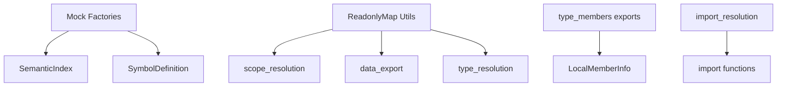

# Sub-Sub-Task Breakdown for task-epic-11.92 Pending Tasks

## Overview

Based on analysis of 169 TypeScript compilation errors across the codebase, this document breaks down the pending tasks (task-epic-11.92.5 through task-epic-11.92.11) into focused sub-sub-tasks targeting specific modules.

## Error Distribution Analysis

### By Module (Top offenders)
- `type_resolution` tests: 77 errors
- `import_resolution` tests: 24 errors
- `function_resolution` tests: 25 errors
- `constructor_resolution` tests: 9 errors
- `data_export` tests: 5 errors
- Other modules: 29 errors

### By Error Type
- TS2339 (Property does not exist): 44 errors
- TS2345 (Argument type mismatch): 22 errors
- TS2739 (Missing properties in type): 21 errors
- TS2740 (Missing properties): 18 errors
- TS2741 (Property missing in type): 14 errors
- TS7006 (Implicit any): 12 errors

---

## task-epic-11.92.5: Fix ReadonlyMap Type Mismatches (1 day)

Focus: Fix attempts to mutate ReadonlyMap in tests and ensure proper type casting.

### Sub-Sub-Tasks

#### 5.1: Fix scope_resolution ReadonlyMap mutations (2 hours)
- **Module**: `function_resolution/scope_resolution.test.ts`
- **Errors**: Lines 355, 356, 357, 546, 1051 - attempting `.push()` on readonly arrays
- **Solution**: Create mutable copies before modification or update test approach

#### 5.2: Fix data_export ReadonlyMap mutations (1.5 hours)
- **Module**: `data_export/data_export.test.ts`
- **Errors**: Lines 324, 393, 400 - attempting to assign to readonly properties
- **Solution**: Update mock data creation to respect readonly constraints

#### 5.3: Fix type_resolution test ReadonlyMap handling (2.5 hours)
- **Module**: `type_resolution/type_resolution.comprehensive.test.ts`
- **Errors**: Multiple instances of incorrect ReadonlyMap usage
- **Solution**: Create helper functions for test data that return proper ReadonlyMap instances

#### 5.4: Create test utilities for ReadonlyMap (2 hours)
- **Module**: New file `test_utils/readonly_helpers.ts`
- **Purpose**: Centralized utilities for creating test data with ReadonlyMaps
- **Functions**: `createReadonlyMapFrom()`, `toMutableCopy()`, `mergeReadonlyMaps()`

---

## task-epic-11.92.6: Fix Interface Property Mismatches (1.5 days)

Focus: Add missing properties to interfaces and align types across modules.

### Sub-Sub-Tasks

#### 6.1: Fix LocalConstructorCall interface (2 hours)
- **Module**: `constructor_resolution.test.ts`
- **Errors**: Missing `scope_id` property in 9 test cases
- **Solution**: Add `scope_id` to all LocalConstructorCall mock objects

#### 6.2: Fix SemanticIndex interface compliance (3 hours)
- **Module**: `function_resolution/` test files
- **Errors**: Missing `local_types`, `local_type_annotations`, `local_type_tracking`, `local_type_flow`
- **Files**: `function_resolution.test.ts`, `resolution_priority.test.ts`
- **Solution**: Update all SemanticIndex mock objects with required properties

#### 6.3: Fix SymbolDefinition properties (2 hours)
- **Module**: `function_resolution/resolution_priority.test.ts`
- **Errors**: Missing `is_hoisted`, `is_exported`, `is_imported` properties
- **Solution**: Add missing properties to all SymbolDefinition instances

#### 6.4: Fix type_resolution test interfaces (3 hours)
- **Module**: `type_resolution/type_resolution.comprehensive.test.ts`
- **Errors**: 77 total errors, many related to interface mismatches
- **Solution**: Align test interfaces with actual implementation types

#### 6.5: Align LocalMemberInfo interfaces (2 hours)
- **Module**: `type_members/index.ts`
- **Issue**: Interface divergence between semantic_index and type_resolution versions
- **Solution**: Create unified interface or conversion utilities

---

## task-epic-11.92.7: Fix Function Signature Mismatches (1 day)

Focus: Correct function calls with wrong argument types or counts.

### Sub-Sub-Tasks

#### 7.1: Fix import_resolution function calls (2 hours)
- **Module**: `import_resolution/import_resolution.comprehensive.test.ts`
- **Errors**: 24 errors related to wrong function signatures
- **Solution**: Update function calls to match expected signatures

#### 7.2: Fix query_loader mock functions (1.5 hours)
- **Module**: `query_loader.test.ts`
- **Errors**: Lines 385, 505 - mock function signature mismatches
- **Solution**: Update mock implementations to match fs.readFileSync signature

#### 7.3: Fix type_resolution function arguments (2.5 hours)
- **Module**: `type_resolution/type_resolution.comprehensive.test.ts`
- **Errors**: Multiple TS2345 errors (argument type mismatches)
- **Solution**: Review and fix all function call arguments

#### 7.4: Fix language_configs capture mappings (2 hours)
- **Module**: `language_configs/python.ts`
- **Error**: Line 156 - CaptureMapping type mismatch
- **Solution**: Ensure all capture mappings return consistent types

---

## task-epic-11.92.8: Fix Object Literal Property Errors (0.5 days)

Focus: Quick fixes for object literal issues.

### Sub-Sub-Tasks

#### 8.1: Fix type_resolution object literals (2 hours)
- **Module**: `type_resolution/type_resolution.comprehensive.test.ts`
- **Errors**: TS2739/2740 errors - missing properties in object literals
- **Solution**: Add all required properties to test objects

#### 8.2: Fix function_resolution mock objects (1.5 hours)
- **Module**: `function_resolution/resolution_priority.test.ts`
- **Errors**: Missing properties in mock objects
- **Solution**: Complete all partial mock objects

#### 8.3: Fix data_export test objects (0.5 hours)
- **Module**: `data_export/data_export.test.ts`
- **Error**: Line 68 - incorrect TypeCategory value
- **Solution**: Use correct enum values

---

## task-epic-11.92.9: Fix Test Infrastructure and Mock Data (1.5 days)

Focus: Comprehensive test infrastructure improvements.

### Sub-Sub-Tasks

#### 9.1: Create comprehensive mock factories (4 hours)
- **Module**: New directory `test_utils/mock_factories/`
- **Files**: `semantic_index_mocks.ts`, `type_mocks.ts`, `symbol_mocks.ts`
- **Purpose**: Centralized, type-safe mock object creation

#### 9.2: Fix type_resolution test infrastructure (3 hours)
- **Module**: `type_resolution/type_resolution.comprehensive.test.ts`
- **Focus**: Complete overhaul of test setup and mock data
- **Solution**: Use new mock factories, ensure type compliance

#### 9.3: Fix import_resolution test setup (2 hours)
- **Module**: `import_resolution/import_resolution.comprehensive.test.ts`
- **Errors**: Missing exports, wrong mock implementations
- **Solution**: Update test setup to match current implementation

#### 9.4: Fix integration test infrastructure (3 hours)
- **Modules**: All files in `integration_tests/`
- **Errors**: Various type mismatches and missing properties
- **Solution**: Update integration test helpers and utilities

---

## task-epic-11.92.10: Fix Module and Export Issues (0.5 days)

Focus: Module resolution and export problems.

### Sub-Sub-Tasks

#### 10.1: Fix type_members exports (1 hour)
- **Module**: `type_members/index.ts`
- **Errors**: TS2459 - LocalMemberInfo and LocalParameterInfo not exported
- **Solution**: Add proper exports to index.ts

#### 10.2: Fix import_resolution imports (1.5 hours)
- **Module**: `import_resolution/import_resolution.comprehensive.test.ts`
- **Errors**: TS2305 - missing exports from index
- **Solution**: Export required functions or import from correct modules

#### 10.3: Fix fixture module references (1.5 hours)
- **Module**: `definitions/fixtures/typescript/comprehensive_definitions.ts`
- **Errors**: Cannot find modules (lines 302, 303)
- **Solution**: Update module paths or create stub modules

---

## task-epic-11.92.11: Fix Remaining Type Issues and Validation (1 day)

Focus: Clean up remaining type issues and ensure full type safety.

### Sub-Sub-Tasks

#### 11.1: Fix implicit any types (2 hours)
- **Various modules**: 12 TS7006 errors
- **Solution**: Add explicit type annotations

#### 11.2: Fix type registry issues (1.5 hours)
- **Module**: `type_registry/index.test.ts`
- **Error**: Line 55 - TS7053 element has any type
- **Solution**: Add proper type indexing

#### 11.3: Fix decorator type issues (1.5 hours)
- **Module**: `definitions/fixtures/typescript/comprehensive_definitions.ts`
- **Errors**: Decorator signature issues (lines 240, 243, 244)
- **Solution**: Update decorator implementations or disable in test fixtures

#### 11.4: Final type validation pass (3 hours)
- **All modules**: Complete type check and fix remaining issues
- **Tools**: Run strict type checking, fix all warnings

---

## Execution Strategy

### Phase 1: Quick Wins (Day 1)
- task-epic-11.92.8 (all sub-tasks) - 4 hours
- task-epic-11.92.10 (all sub-tasks) - 4 hours

### Phase 2: Core Infrastructure (Days 2-3)
- task-epic-11.92.9.1 - Create mock factories - 4 hours
- task-epic-11.92.5.4 - Create ReadonlyMap utilities - 2 hours
- task-epic-11.92.6.1, 6.2, 6.3 - Fix core interfaces - 7 hours

### Phase 3: Module-Specific Fixes (Days 4-5)
- task-epic-11.92.5.1, 5.2, 5.3 - ReadonlyMap fixes - 6 hours
- task-epic-11.92.6.4, 6.5 - Interface alignment - 5 hours
- task-epic-11.92.7 (all sub-tasks) - Function signatures - 8 hours

### Phase 4: Test Infrastructure (Days 6-7)
- task-epic-11.92.9.2, 9.3, 9.4 - Test infrastructure - 8 hours
- task-epic-11.92.11 (all sub-tasks) - Final cleanup - 8 hours

## Success Metrics

### Per Module Success Criteria
- `type_resolution`: 0 compilation errors (from 77)
- `import_resolution`: 0 compilation errors (from 24)
- `function_resolution`: 0 compilation errors (from 25)
- `constructor_resolution`: 0 compilation errors (from 9)
- All other modules: 0 compilation errors

### Overall Success
```bash
npm run build
# Expected: Build completes with 0 TypeScript errors

npm test
# Expected: All tests pass or fail for logic reasons, not type errors
```

## Risk Mitigation

### High Risk Areas
1. **type_resolution tests** - 77 errors concentrated here
   - Mitigation: Dedicate experienced developer, work in small batches

2. **Interface divergence** - Multiple incompatible interface definitions
   - Mitigation: Create conversion utilities if unification is too complex

3. **Mock data complexity** - Tests using incorrect mock structures
   - Mitigation: Centralized mock factories with type validation

### Rollback Strategy
- Each sub-sub-task is atomic and can be reverted independently
- Maintain a branch per major task (5-11) for isolation
- Run tests after each sub-sub-task to ensure no regression

## Dependencies Between Sub-Tasks



## Notes

- Sub-sub-tasks are designed to be completed in 0.5-4 hour blocks
- Each focuses on a single module to minimize context switching
- Dependencies are explicitly marked
- Total estimated time: 7-8 days with one developer
- Can be parallelized across 2-3 developers to complete in 3-4 days