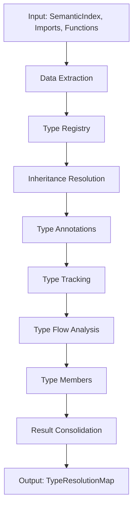

# Task Epic 11.96.1: Data Flow Architecture

**Task ID**: task-epic-11.96.1
**Component**: Data Flow and Orchestration Design
**Status**: In Design
**Created**: 2025-01-24

## Overview

This document describes the data flow architecture and orchestration strategy for the consolidated type resolution system. It defines how data moves through the pipeline, dependencies between modules, and the orchestration patterns that ensure correct and efficient processing.

## 1. Data Flow Principles

### 1.1 Core Principles

1. **Unidirectional Flow**: Data flows in one direction through the pipeline
2. **Immutable Data**: All data structures are read-only after creation
3. **Pure Transformations**: Each module performs pure functional transformations
4. **Explicit Dependencies**: Module dependencies are explicitly declared
5. **Error Propagation**: Errors flow up through the pipeline without side effects

### 1.2 Data Flow Patterns

```
Input → Extract → Transform → Aggregate → Output
```

- **Extract**: Pull data from semantic indices
- **Transform**: Process data through specialized modules
- **Aggregate**: Combine results from multiple modules
- **Output**: Produce consolidated type resolution map

## 2. Pipeline Architecture

### 2.1 Three-Layer Processing Model

```
┌────────────────────────────────────────────────┐
│                 LAYER 1: ORCHESTRATION          │
│                 symbol_resolution.ts            │
│  • Coordinates overall pipeline                 │
│  • Manages phase transitions                    │
│  • Handles error aggregation                    │
└────────────────────────────────────────────────┘
                         │
                         ▼
┌────────────────────────────────────────────────┐
│              LAYER 2: TYPE RESOLUTION           │
│             type_resolution/index.ts            │
│  • Extracts data from semantic indices          │
│  • Orchestrates specialized modules             │
│  • Consolidates results                         │
└────────────────────────────────────────────────┘
                         │
                         ▼
┌────────────────────────────────────────────────┐
│           LAYER 3: SPECIALIZED MODULES          │
│  • Type Registry    • Type Flow                 │
│  • Inheritance      • Type Members              │
│  • Annotations      • Type Tracking             │
└────────────────────────────────────────────────┘
```

### 2.2 Module Execution Order



## 3. Detailed Data Flow

### 3.1 Phase 1: Data Extraction

```typescript
// Input: Raw semantic indices
const indices: Map<FilePath, SemanticIndex>

// Extraction Process
function extract_local_types(indices) {
  return {
    type_definitions: Map<FilePath, LocalTypeDefinition[]>,
    type_annotations: Map<FilePath, LocalTypeAnnotation[]>,
    type_tracking: Map<FilePath, LocalTypeTracking[]>,
    type_flows: Map<FilePath, LocalTypeFlowPattern[]>
  }
}

// Output: Structured local type data
const local_types: LocalTypeExtraction
```

**Data Dependencies**: None (first phase)
**Data Produced**: Local type information organized by file
**Processing Pattern**: Parallel per-file extraction

### 3.2 Phase 2: Type Registry Building

```typescript
// Input: Local type definitions + imports
const input = {
  type_definitions: local_types.type_definitions,
  imports: resolved_imports
}

// Processing
function build_global_type_registry(input) {
  // 1. Create TypeId for each definition
  // 2. Map names to TypeIds
  // 3. Resolve cross-file references
  // 4. Build global registry
}

// Output: Global type registry
const type_registry: GlobalTypeRegistry = {
  types: Map<TypeId, TypeDefinition>,
  type_names: Map<FilePath, Map<SymbolName, TypeId>>,
  symbol_types: Map<SymbolId, TypeId>
}
```

**Data Dependencies**: Type definitions, imports
**Data Produced**: Global type registry with unique TypeIds
**Processing Pattern**: Sequential with cross-file resolution

### 3.3 Phase 3: Inheritance Resolution

```typescript
// Input: Type definitions + registry + imports
const input = {
  type_definitions: local_types.type_definitions,
  type_registry: type_registry,
  imports: resolved_imports
}

// Processing
function resolve_inheritance(input) {
  // 1. Build extends relationships
  // 2. Build implements relationships
  // 3. Detect circular dependencies
  // 4. Create topological ordering
}

// Output: Type hierarchy graph
const type_hierarchy: TypeHierarchyGraph = {
  extends_map: Map<TypeId, TypeId[]>,
  implements_map: Map<TypeId, TypeId[]>,
  children_map: Map<TypeId, TypeId[]>,
  topological_order: TypeId[]
}
```

**Data Dependencies**: Type registry (for TypeId lookup)
**Data Produced**: Complete inheritance hierarchy
**Processing Pattern**: Graph construction with cycle detection

### 3.4 Phase 4: Type Annotations

```typescript
// Input: Annotations + registry + imports
const input = {
  annotations: local_types.type_annotations.flat(),
  type_registry: type_registry,
  imports: resolved_imports
}

// Processing
function resolve_type_annotations(input) {
  // 1. Parse annotation strings
  // 2. Resolve type references
  // 3. Handle union/intersection types
  // 4. Map to locations
}

// Output: Resolved annotations
const annotation_types: Map<LocationKey, TypeId>
```

**Data Dependencies**: Type registry (for type resolution)
**Data Produced**: Location-based type annotations
**Processing Pattern**: Parallel annotation resolution

### 3.5 Phase 5: Type Tracking

```typescript
// Input: Tracking data + registry + imports
const input = {
  type_tracking: local_types.type_tracking,
  type_registry: type_registry,
  imports: resolved_imports
}

// Processing
function resolve_type_tracking(input) {
  // 1. Track variable declarations
  // 2. Track parameter types
  // 3. Track return types
  // 4. Build symbol-type mappings
}

// Output: Symbol type mappings
const tracked_types: Map<SymbolId, TypeId>
```

**Data Dependencies**: Type registry
**Data Produced**: Symbol-to-type mappings
**Processing Pattern**: Sequential variable tracking

### 3.6 Phase 6: Type Flow Analysis

```typescript
// Input: Flow patterns + functions + registry + imports
const input = {
  type_flows: local_types.type_flows,
  functions: resolved_functions,
  type_registry: type_registry,
  imports: resolved_imports
}

// Processing
function analyze_type_flow(input) {
  // 1. Build flow graph
  // 2. Analyze assignments
  // 3. Track type propagation
  // 4. Infer types from usage
}

// Output: Type flow analysis
const type_flow: TypeFlowAnalysis = {
  assignment_types: Map<LocationKey, TypeId>,
  flow_edges: FlowEdge[],
  inferred_types: Map<SymbolId, TypeId>,
  narrowing: Map<LocationKey, TypeNarrowing>
}
```

**Data Dependencies**: Type registry, function signatures
**Data Produced**: Type flow graph and inferences
**Processing Pattern**: Graph-based flow analysis

### 3.7 Phase 7: Type Members Resolution

```typescript
// Input: Definitions + hierarchy + registry
const input = {
  type_definitions: local_types.type_definitions,
  type_hierarchy: type_hierarchy,
  type_registry: type_registry
}

// Processing
function resolve_type_members(input) {
  // 1. Collect direct members
  // 2. Resolve inherited members
  // 3. Handle method overrides
  // 4. Check interface implementations
}

// Output: Complete member maps
const type_members: Map<TypeId, Map<SymbolName, ResolvedMemberInfo>>
```

**Data Dependencies**: Type registry, inheritance hierarchy
**Data Produced**: Complete member information with inheritance
**Processing Pattern**: Hierarchical traversal

### 3.8 Phase 8: Result Consolidation

```typescript
// Input: All phase results
const results = {
  type_registry,
  type_hierarchy,
  annotation_types,
  tracked_types,
  type_flow,
  type_members
}

// Processing
function consolidate_results(results) {
  // 1. Merge location types
  // 2. Merge symbol types
  // 3. Validate consistency
  // 4. Build final output
}

// Output: Consolidated type resolution
const output: TypeResolutionOutput = {
  type_registry,
  type_hierarchy,
  reference_types: Map<LocationKey, TypeId>,
  symbol_types: Map<SymbolId, TypeId>,
  type_members,
  type_flow
}
```

**Data Dependencies**: All previous phases
**Data Produced**: Final consolidated output
**Processing Pattern**: Result aggregation and validation

## 4. Orchestration Patterns

### 4.1 Main Orchestrator Pattern

```typescript
// symbol_resolution.ts
export function phase3_resolve_types(
  indices: Map<FilePath, SemanticIndex>,
  imports: Map<FilePath, Map<SymbolName, SymbolId>>,
  functions: FunctionResolutionMap
): TypeResolutionMap {
  try {
    // Simple delegation to type resolution module
    const result = resolve_all_types({ indices, imports, functions });

    // Convert to legacy format if needed
    return convert_to_type_resolution_map(result);
  } catch (error) {
    // Error handling and recovery
    handle_type_resolution_error(error);
  }
}
```

### 4.2 Type Resolution Hub Pattern

```typescript
// type_resolution/index.ts
export function resolve_all_types(
  input: TypeResolutionInput
): TypeResolutionOutput {
  // Extract data from indices
  const local_types = extract_local_types(input.indices);

  // Execute phases in sequence
  const type_registry = build_global_type_registry({
    type_definitions: local_types.type_definitions,
    imports: input.imports
  });

  const type_hierarchy = resolve_inheritance({
    type_definitions: local_types.type_definitions,
    imports: input.imports,
    type_registry
  });

  const annotation_types = resolve_type_annotations({
    annotations: flatten(local_types.type_annotations),
    type_registry,
    imports: input.imports
  });

  const tracked_types = resolve_type_tracking({
    type_tracking: local_types.type_tracking,
    type_registry,
    imports: input.imports
  });

  const type_flow = analyze_type_flow({
    type_flows: local_types.type_flows,
    functions: input.functions,
    type_registry,
    imports: input.imports
  });

  const type_members = resolve_type_members({
    type_definitions: local_types.type_definitions,
    type_hierarchy,
    type_registry
  });

  // Consolidate results
  return consolidate_results({
    type_registry,
    type_hierarchy,
    annotation_types,
    tracked_types,
    type_flow,
    type_members
  });
}
```

### 4.3 Specialized Module Pattern

```typescript
// Example: type_registry/type_registry.ts
export function build_global_type_registry(
  input: TypeRegistryInput
): GlobalTypeRegistry {
  const registry = create_empty_registry();

  // Process each file's type definitions
  for (const [file_path, definitions] of input.type_definitions) {
    for (const definition of definitions) {
      // Create TypeId
      const type_id = create_type_id(definition);

      // Register type
      register_type(registry, type_id, definition);

      // Map name to TypeId
      map_type_name(registry, file_path, definition.name, type_id);

      // Resolve imported references
      resolve_type_references(registry, definition, input.imports);
    }
  }

  return validate_registry(registry);
}
```

## 5. Data Dependencies Graph

### 5.1 Module Dependency Matrix

| Module | Depends On | Produces | Used By |
|--------|------------|----------|---------|
| Type Registry | Type Definitions, Imports | GlobalTypeRegistry | All modules |
| Inheritance | Type Registry, Imports | TypeHierarchyGraph | Type Members |
| Annotations | Type Registry, Imports | Location→Type mappings | Consolidation |
| Type Tracking | Type Registry, Imports | Symbol→Type mappings | Consolidation |
| Type Flow | Type Registry, Functions | Flow analysis | Consolidation |
| Type Members | Type Registry, Inheritance | Member mappings | Consolidation |

### 5.2 Dependency Resolution Order

```
1. Type Registry (no dependencies)
2. Inheritance (depends on registry)
3. Annotations (depends on registry)
4. Type Tracking (depends on registry)
5. Type Flow (depends on registry)
6. Type Members (depends on registry + inheritance)
7. Consolidation (depends on all)
```

## 6. Error Handling Flow

### 6.1 Error Propagation Pattern

```typescript
// Errors flow upward through the layers
Module Error → Type Resolution Hub → Symbol Resolution → User

// Each layer can:
1. Handle and recover
2. Transform and re-throw
3. Aggregate multiple errors
4. Provide fallback values
```

### 6.2 Error Recovery Strategy

```typescript
interface ErrorRecovery {
  // Continue with partial results
  partial_recovery(error: Error): Partial<TypeResolutionOutput>;

  // Use default values
  default_recovery(error: Error): TypeResolutionOutput;

  // Fail fast
  fail_fast(error: Error): never;
}

// Example recovery in type registry
function build_global_type_registry_safe(input): Result<GlobalTypeRegistry> {
  try {
    return { ok: true, value: build_global_type_registry(input) };
  } catch (error) {
    if (can_recover(error)) {
      return { ok: true, value: partial_registry(input) };
    }
    return { ok: false, error };
  }
}
```

## 7. Performance Optimization Strategies

### 7.1 Parallel Processing Opportunities

```typescript
// Phases that can run in parallel after type registry is built
const parallel_phases = Promise.all([
  resolve_type_annotations(annotation_input),
  resolve_type_tracking(tracking_input),
  analyze_type_flow(flow_input)
]);

// Wait for parallel results
const [annotations, tracking, flow] = await parallel_phases;
```

### 7.2 Caching Strategy

```typescript
interface CacheablePhase {
  // Cache key generation
  cache_key(input: any): string;

  // Check cache before processing
  get_cached(key: string): any | undefined;

  // Store result in cache
  set_cached(key: string, result: any): void;
}

// Example caching wrapper
function with_cache<T>(
  phase_fn: (input: T) => any,
  cache: CacheablePhase
): (input: T) => any {
  return (input: T) => {
    const key = cache.cache_key(input);
    const cached = cache.get_cached(key);

    if (cached) return cached;

    const result = phase_fn(input);
    cache.set_cached(key, result);
    return result;
  };
}
```

### 7.3 Incremental Processing

```typescript
interface IncrementalPhase {
  // Process only changed files
  process_incremental(
    previous: any,
    changed_files: Set<FilePath>
  ): any;

  // Merge incremental results
  merge_results(previous: any, incremental: any): any;
}

// Example incremental type registry
function update_type_registry_incremental(
  previous_registry: GlobalTypeRegistry,
  changed_files: Set<FilePath>,
  new_definitions: Map<FilePath, LocalTypeDefinition[]>
): GlobalTypeRegistry {
  // Remove old types from changed files
  const cleaned = remove_file_types(previous_registry, changed_files);

  // Add new types from changed files
  const updated = add_file_types(cleaned, new_definitions);

  return updated;
}
```

## 8. Data Validation Points

### 8.1 Input Validation

```typescript
// Validate at module entry points
function validate_type_registry_input(input: TypeRegistryInput): void {
  assert(input.type_definitions !== null, "Type definitions required");
  assert(input.imports !== null, "Imports required");

  for (const [file, defs] of input.type_definitions) {
    assert(is_valid_filepath(file), `Invalid file path: ${file}`);
    for (const def of defs) {
      assert(is_valid_type_definition(def), `Invalid type definition: ${def.name}`);
    }
  }
}
```

### 8.2 Output Validation

```typescript
// Validate module outputs
function validate_type_registry_output(registry: GlobalTypeRegistry): void {
  // Check for duplicate TypeIds
  const type_ids = new Set();
  for (const [id, def] of registry.types) {
    assert(!type_ids.has(id), `Duplicate TypeId: ${id}`);
    type_ids.add(id);
  }

  // Check cross-references
  for (const [file, names] of registry.type_names) {
    for (const [name, id] of names) {
      assert(registry.types.has(id), `Missing type for ID: ${id}`);
    }
  }
}
```

### 8.3 Consistency Validation

```typescript
// Validate data consistency between phases
function validate_consistency(output: TypeResolutionOutput): void {
  // All TypeIds in members should exist in registry
  for (const [type_id] of output.type_members) {
    assert(output.type_registry.types.has(type_id),
      `Type ${type_id} in members not in registry`);
  }

  // All inheritance relationships should reference valid types
  for (const [child, parents] of output.type_hierarchy.extends_map) {
    assert(output.type_registry.types.has(child),
      `Child type ${child} not in registry`);
    for (const parent of parents) {
      assert(output.type_registry.types.has(parent),
        `Parent type ${parent} not in registry`);
    }
  }
}
```

## 9. Data Transformation Patterns

### 9.1 Map-Reduce Pattern

```typescript
// Map phase: Process each file independently
const file_results = Array.from(input.indices.entries()).map(
  ([file, index]) => process_file(file, index)
);

// Reduce phase: Combine results
const combined_result = file_results.reduce(
  (acc, result) => merge_results(acc, result),
  empty_result()
);
```

### 9.2 Pipeline Pattern

```typescript
// Chain transformations
const result = pipe(
  input,
  extract_types,
  build_registry,
  resolve_hierarchy,
  resolve_members,
  consolidate_output
);

// Pipe utility
function pipe<T>(value: T, ...fns: Array<(x: any) => any>): any {
  return fns.reduce((v, fn) => fn(v), value);
}
```

### 9.3 Visitor Pattern

```typescript
// Visit each type in the registry
function visit_all_types(
  registry: GlobalTypeRegistry,
  visitor: TypeVisitor<void>
): void {
  for (const [id, type] of registry.types) {
    switch (type.kind) {
      case "class":
        visitor.visit_class(type);
        break;
      case "interface":
        visitor.visit_interface(type);
        break;
      case "type":
        visitor.visit_type_alias(type);
        break;
      case "enum":
        visitor.visit_enum(type);
        break;
    }
  }
}
```

## 10. Data Flow Monitoring

### 10.1 Tracing

```typescript
interface DataFlowTrace {
  phase: string;
  input_size: number;
  output_size: number;
  duration: number;
  errors: Error[];
}

// Trace data flow through pipeline
function trace_phase<T, U>(
  phase_name: string,
  phase_fn: (input: T) => U
): (input: T) => U {
  return (input: T) => {
    const start = performance.now();
    const trace: DataFlowTrace = {
      phase: phase_name,
      input_size: calculate_size(input),
      output_size: 0,
      duration: 0,
      errors: []
    };

    try {
      const result = phase_fn(input);
      trace.output_size = calculate_size(result);
      trace.duration = performance.now() - start;
      log_trace(trace);
      return result;
    } catch (error) {
      trace.errors.push(error);
      trace.duration = performance.now() - start;
      log_trace(trace);
      throw error;
    }
  };
}
```

### 10.2 Metrics Collection

```typescript
// Collect metrics at each phase
const metrics = {
  types_processed: 0,
  files_processed: 0,
  errors_encountered: 0,
  cache_hits: 0,
  cache_misses: 0,

  record_type(type_id: TypeId): void {
    this.types_processed++;
  },

  record_file(file: FilePath): void {
    this.files_processed++;
  },

  record_error(error: Error): void {
    this.errors_encountered++;
  },

  get_summary(): MetricsSummary {
    return {
      types_processed: this.types_processed,
      files_processed: this.files_processed,
      errors_encountered: this.errors_encountered,
      cache_hit_rate: this.cache_hits / (this.cache_hits + this.cache_misses)
    };
  }
};
```

## Summary

This data flow architecture provides:

1. **Clear pipeline structure** with well-defined phases
2. **Explicit data dependencies** between modules
3. **Unidirectional data flow** for predictability
4. **Error handling patterns** for robustness
5. **Performance optimization** opportunities
6. **Validation checkpoints** for correctness
7. **Monitoring capabilities** for observability

The architecture ensures:
- **Modularity**: Each phase can be developed and tested independently
- **Scalability**: Parallel processing where possible
- **Maintainability**: Clear separation of concerns
- **Reliability**: Error recovery and validation
- **Performance**: Caching and incremental processing support