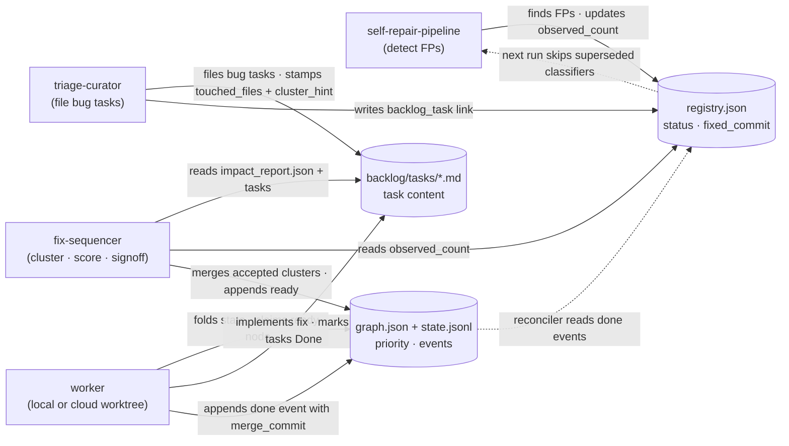

## Description

<!-- SECTION:DESCRIPTION:BEGIN -->

## Why

Two upstream skills (`self-repair-pipeline`, `triage-curator`) currently land tasks in the backlog one-by-one with no view of which to ship first, no cross-task overlap analysis, and no closed loop from "task shipped" to "registry status updated." `fix-sequencer` is the third and final skill in the self-healing chain — the only stage that asks the user a _strategic_ question. It earns its place in the intention tree by accelerating the rate at which root-cause fixes land, which directly improves call-graph fidelity (the trunk).

## Three-store architecture (one per concern)

- **Registry (`.claude/skills/self-repair-pipeline/known_issues/registry.json`)** = shared truth between detection and fix-delivery. Group status (`wip` / `fixed`) and `fixed_commit` / `fixed_in_run`.
- **Backlog (`backlog/tasks/*.md`)** = canonical store of _task content_ (descriptions, AC, references). A "dumping ground" with no inherent ordering.
- **fix-sequencer graph + state log (`~/.ariadne/fix-sequencer/{graph.json,state.jsonl}`)** = canonical store of _priority and ordering_ + append-only execution events. Git-independent so parallel cloud workers can drain it without competing for git state.

## High-level flow

The dotted arrows close the self-healing loop: a `done` event causes the reconciler to flip `registry.status: wip → fixed` on the next pipeline prep, after which superseded classifiers are skipped and `diff_runs --annotate-fixes` labels the resulting FP↔TP transitions as "expected".

## Vocabulary

- **cluster** — a set of backlog tasks that share enough features to be worth shipping as one unit.
- **cluster_hint** — label written by triage-curator on each ariadne-bug task = the `root_cause_category` of the issue (one of: `receiver_resolution`, `import_resolution`, `cross_file_flow`, `syntactic_extraction`, `coverage_config`, `other`).
- **touched_files** — best-effort list of repo-relative POSIX paths the investigator believes a fix will edit; stamped on each curator-filed task by 190.18.2.
- **complexity** — heuristic S/M/L/XL label from `(touched_files_count, distinct_subsystems, root_cause_category)`. Maps to weights 1/3/8/21.
- **subsystem** — a coarse area of the Ariadne core code (`resolver`, `tree_sitter`, `signal_library`, `entry_point_walk`, etc.) inferred from `touched_files` paths via a documented prefix table.
- **blast_radius** — `isolated` | `shared` | `core_resolver`, derived from how many subsystems a cluster's `touched_files` span.
- **is_pareto_frontier** — boolean flag on a cluster: it is non-dominated on `(impact, -complexity, -risk)`.
- **intra_order** — the suggested execution order of member tasks inside a cluster (e.g. refactor first, then per-task fixes).
- **graph node / state event** — see `## Three-store architecture` above.

## Stages

1. Cluster ~117 existing TASK-190.16.x tasks (root_cause_category × Jaccard on `touched_files`; on the v1 corpus expect mostly singletons until backfill ships)
2. Heuristic complexity + impact scoring + Pareto frontier flag
3. Render `plan.md` + `clusters.json`
4. AskUserQuestion accept/drop/defer per cluster
5. Merge accepted clusters into `graph.json` and append `ready` events to `state.jsonl`
6. Worker drains graph (single-worker assumption in v1)
7. Reconciler in self-repair-pipeline reads `state.jsonl` `done` events to flip registry `status: wip → fixed`

## Sub-tasks (10 active; 4 archived after Reviewer 2 merges)

Phase A — upstream prep: 190.18.1 (impact_report.json), 190.18.2 (touched_files + cluster_hint stamp), 190.18.3 (registry fix-tracking fields + reconciler), 190.18.5 (diff_runs --annotate-fixes).

Phase B — skill scaffold: 190.18.6.

Phase C — clustering & scoring: 190.18.7 (cluster + score + Pareto frontier).

Phase D — signoff & graph-write: 190.18.9 (render + signoff + worker contract + drain stub + /schedule), 190.18.11 (graph node write + ready event + calibration `predicted` writer).

Phase E — verification & docs: 190.18.13, 190.18.14.

**Archived (merged):** 190.18.4 (reconciler → folded into .3), 190.18.8 (scoring → folded into .7), 190.18.10 (signoff loop → folded into .9), 190.18.12 (worker contract + calibration + /schedule → folded into .9, with `predicted` writer moved to .11). Reviewer 2 flagged these as cuts that doubled test scaffolding without integration value; the merges preserve all the original AC items, distributed across the surviving tasks.

## Deferred to v1.5

LLM `cluster-sizer`; refactor child tasks `TASK-190.19.n.m`; `predicted_fix_subsystem` upstream enum; cross-run `diff_plans.ts`.

## Plan reference

Full plan: `/Users/chuck/.claude/plans/i-d-like-to-make-nested-creek.md`

<!-- SECTION:DESCRIPTION:END -->

## Acceptance Criteria

<!-- AC:BEGIN -->

- [ ] #1 All 10 active sub-tasks (190.18.1, .2, .3, .5, .6, .7, .9, .11, .13, .14) created and linked under this umbrella; .4/.8/.10/.12 archived per Reviewer 2 merges
- [ ] #2 Running `prepare_plan.ts` + `finalize_plan.ts` on the existing TASK-190.16.x backlog produces ≥1 cluster node in `graph.json` and prints a `/schedule` one-liner — without needing 190.18.3/.5 to ship
- [ ] #3 Loop closure verified end-to-end: after appending a synthetic `done` event with `merge_commit: <sha>`, the targeted registry entry's `status === 'fixed'` AND `fixed_commit === <sha>` (assert exact values, not existence)
- [ ] #4 Three skill READMEs cross-reference correctly (self-repair-pipeline → triage-curator → fix-sequencer)
- [ ] #5 No backwards-compatibility shims; intention-tree namings only (no `enhanced_*` / `*_v2` files)
<!-- AC:END -->
