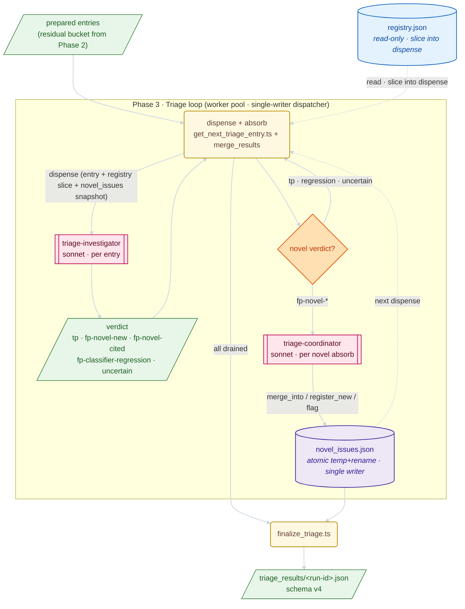

## Description

<!-- SECTION:DESCRIPTION:BEGIN -->

## Why

The per-entry `triage-investigator` already holds the full investigation context for each false-positive entry — source code, call graph, diagnosis category, and (after this redesign) the in-scope registry slice. The current Phase 3+4 pipeline discards that context after emitting a free-form `group_id`, then rebuilds it twice in Phase 4 (`rough-aggregator` consolidating names per slice, `group-investigator` re-fetching evidence to verify membership per group). Three LLM stages over the same evidence is the inefficiency. Worse, free-form `group_id`s force the aggregation cascade to exist at all: there is no canonical key for parallel per-entry agents to converge on without coordination.

This redesign pushes the full triage decision into the per-entry agent, and moves the only genuinely cross-entry decision — "is this novel issue actually new, or a duplicate of one another agent just registered?" — into a small `triage-coordinator` sub-agent that runs on each novel-verdict absorb. Phase 4's aggregation cascade collapses entirely, and the curator inherits an already-consolidated novel-issues set.

## Architecture

### Per-entry verdict schema

`triage-investigator` emits one of:

- **`tp`** — genuinely unreachable. Confirms the call graph; no further action.
- **`fp-novel-new`** — false positive whose gap does not match anything in the run's current `novel_issues.json` snapshot. Agent emits a full registration: `proposed_root_cause`, `evidence_excerpt`, `member_evidence`.
- **`fp-novel-cited`** — false positive whose gap matches an already-registered novel issue. Agent emits a citation: existing `novel_issue_id` + `evidence_excerpt`. Early-exits without re-investigating.
- **`fp-classifier-regression`** — false positive whose gap _should_ have been caught by an existing wip/permanent classifier rule but was not (predicate too narrow). Agent emits `should_have_matched_rule_id` + `evidence_excerpt`. This is classifier-drift detection moved upstream of the curator's QA sample-rate loop.
- **`uncertain`** — agent could not reduce the entry to a single verdict (compounding gaps, ambiguous evidence). Surfaced to the curator for human-tier review at promotion time.

Verdict is a TypeScript discriminated union with a single `kind` field; each kind has its own required payload (no optional-everywhere shape).

### Three-store architecture (per-run)

- **`triage_state` (existing)** — per-entry result store. Write surface unchanged.
- **`novel_issues.json` (new, per-run)** — consolidated novel-issue list. Single writer (the dispatcher); atomic temp+rename. Each issue: `{ id, canonical_name, root_cause, citations: [{ entry_index, evidence_excerpt }] }`. Read into every dispense payload.
- **`registry.json` (existing, read-only here)** — the slice relevant to each dispensed entry (matched against `diagnosis_category` + `file_path` prefix) is bundled into the dispense payload, so investigators can detect `fp-classifier-regression` against in-scope rules without loading the full registry.

### Coordinator placement

The `triage-coordinator` sub-agent fires synchronously between absorb and next-dispense, **only** when the absorbed verdict is novel (`fp-novel-new` | `fp-novel-cited`). For `tp`, `fp-classifier-regression`, and `uncertain`, the dispatcher absorbs the result directly without coordinator involvement.

Inputs: current `novel_issues.json` + the just-absorbed proposal. Outputs:

- **`merge_into: <existing_id>`** — proposal is a duplicate of an existing issue under a different name; absorb as a citation.
- **`register_new: { canonical_name, root_cause }`** — proposal is genuinely new; coordinator assigns the canonical name.
- **`flag: { reason }`** — proposal is ambiguous; surface for human review at curator promotion time.

Coordinator decisions are logged with the evidence they saw, so the curator can detect drift across a run.

## High-level flow

**Reading the diagram**: the worker pool fans out from a single-writer dispatcher; the per-entry investigator returns a discriminated verdict; the coordinator only fires on novel verdicts and updates the per-run `novel_issues.json`. The previous Phase 4 (aggregator + group-investigator + slices + pass1/pass2) is gone — `finalize_triage.ts` reads `novel_issues.json` directly.

## What collapses

- `rough-aggregator` (Phase 4 pass 1) — gone. Consolidation happens inline via the coordinator.
- `group-investigator` (Phase 4 pass 2) — gone. Per-member verification was redundant given the per-entry investigator already saw the source.
- `prepare_aggregation_slices.ts`, `merge_rough_groups.ts`, `finalize_aggregation.ts` — gone.
- `aggregation/{slices,pass1,pass2}/` directory tree — gone.
- `triage-curator-investigator` narrows from "discover root causes" to "promote registered novel issues to permanent classifier rules + backlog tasks". Its existing classifier-spec authoring role is retained.

## What survives

- The dispatcher's dispense/absorb cycle (`get_next_triage_entry.ts` + `merge_results`) — extended, not replaced.
- The curator's QA sample-rate drift detection — retained as a statistical lagging signal, complementary to the in-flight `fp-classifier-regression` flag.
- `finalize_triage.ts` — re-targeted to read `novel_issues.json` instead of `pass2/*_investigation.json`.
- The classifier-lifecycle write-boundary contract (`.claude/rules/classifier-lifecycle.md`) — unchanged. The new `triage-coordinator` writes only the per-run `novel_issues.json`, not the global `registry.json`.

## Sub-tasks

Phase A — foundations:

- **190.19.1** — Verdict schema (`TriageVerdict` discriminated union) + `novel_issues.json` storage contract.

Phase B — coordinator:

- **190.19.2** — `triage-coordinator` sub-agent + dispatcher absorb path.

Phase C — investigator behavior:

- **190.19.3** — `triage-investigator` prompt + dispense payload extension.
- **190.19.4** — `fp-classifier-regression` → curator drift signal wiring.

Phase D — Phase 4 collapse + finalize re-targeting:

- **190.19.5** — Remove aggregator cascade; re-target `finalize_triage.ts` to `novel_issues.json`; bump published schema to v4.

Phase E — curator integration:

- **190.19.6** — Curator absorb path: consume v4 `triage_results` + route novel-issues + regressions.
- **190.19.7** — Narrow `triage-curator-investigator` agent to promotion-only role.
- **190.19.8** — Update `find-promotion-candidates` + verify curator-QA against v4 schema.

Phase F — skill rename:

- **190.19.9** — Rename `triage-entrypoints` skill to `triage-entrypoints` (`git mv` + cross-ref sweep). Macro-name "self-healing pipeline" retained for the chain-level concept.

Phase G — docs & diagrams:

- **190.19.10** — Update `triage-entrypoints` README + curator README + cross-references (`task-190.18`, `classifier-lifecycle.md`).

## Constraints

- **No backwards compatibility.** The new schema replaces the old verdict shape; downstream consumers (curator, fix-sequencer reconciler, `diff_runs`) update in lockstep. No transitional adapters.
- **Single-writer invariant.** Sub-agents never write `novel_issues.json` directly — only through the dispatcher. Enforced by sub-agent tool allowlists.
- **Atomic writes.** All persistent surface writes use temp+rename (the same `atomic_write_file` helper the curator uses for registry writes).
- **Write-boundary contract preserved.** The coordinator writes only the per-run `novel_issues.json`, not the global `registry.json` — the curator remains the sole autonomous wip-row writer per `.claude/rules/classifier-lifecycle.md`.

<!-- SECTION:DESCRIPTION:END -->

## Acceptance Criteria

<!-- AC:BEGIN -->

- [x] #1 All 10 sub-tasks (190.19.1 through 190.19.10) created and linked under this umbrella
- [ ] #2 End-to-end run on a representative project produces a non-empty `novel_issues.json` and zero artifacts under `aggregation/` *(manual verification — see Implementation Notes below)*
- [x] #3 At least one `fp-classifier-regression` flag is detected and surfaced to the curator when a wip classifier is intentionally narrowed to miss known matches (regression test fixture at `.claude/skills/triage-curator/src/classifier_regression_chain.test.ts`)
- [x] #4 `aggregation/` directory tree is removed from the repository; `rough-aggregator`, `group-investigator`, `prepare_aggregation_slices.ts`, `merge_rough_groups.ts`, `finalize_aggregation.ts` no longer exist
- [x] #5 No backwards-compatibility shims; downstream consumers (curator, fix-sequencer reconciler, `diff_runs`) updated to read `novel_issues.json` directly
- [x] #6 `triage-entrypoints` README and curator README diagrams reflect the collapsed Phase 4 — no `rough-aggregator` / `group-investigator` boxes remain
- [x] #7 Classifier-lifecycle write-boundary contract is preserved — `triage-coordinator` writes only the per-run `novel_issues.json`
- [x] #8 Skill renamed from `self-repair-pipeline` to `triage-entrypoints` via `git mv`; macro-name "self-healing pipeline" retained as the chain-level concept
<!-- AC:END -->

## Implementation Notes

### Final review (15 parallel Opus agents)

After the ten sub-tasks landed, a 15-agent parallel review surfaced one
contract gap, several skill-rename leftovers, and a divergent filename gate.
Acted-on findings:

- **`fixed`-row protection in curator drift absorb** —
  `absorb_classifier_regressions` was guarding only `permanent` rows, so a
  `fixed` rule whose `group_id` resurfaces in `classifier_regressions[]`
  would have been silently drift-tagged. Lifecycle contract reserves
  `fixed`-row mutations for the fix-sequencer reconciler. Added a
  `skipped_fixed_rule_ids` partition in `curator_drift_absorb.ts`, wired
  into `apply_proposals` and surfaced in the finalize summary.
- **`parse_novel_verdict` narrowing helper** — added `expect_novel_verdict`
  + `parse_novel_verdict` to `triage_verdict.ts` so callers consuming raw
  JSON known to be a novel verdict cannot accidentally pass a `tp` or
  `fp-classifier-regression` shape into the novel-issue storage mutators.
- **Filename-gate divergence between `merge_results` and finalize** —
  `merge_results.ts` accepted `parseInt(basename)` (which tolerates `-3`,
  `01`, `+5`) while `load_verdicts_by_entry_index` already required
  `^(0|[1-9]\d*)$`. Hoisted `VERDICT_FILE_BASENAME` out of
  `build_finalization_output.ts` and reused it in `merge_results.ts` so
  the absorb-time gate matches the finalize-time gate.
- **Skill-rename completion** — renamed
  `ARIADNE_SELF_REPAIR_DIR_OVERRIDE` →
  `ARIADNE_TRIAGE_ENTRYPOINTS_DIR_OVERRIDE` across `paths.ts` + five test
  files, and bulk-replaced stale `.claude/skills/self-repair-pipeline/`
  and `~/.ariadne/self-repair-pipeline/` references in
  `backlog/docs/TASK-190.17-classification-overview.md`.
- **AC#3 regression fixture** — added
  `classifier_regression_chain.test.ts` exercising the wire chain end-to-
  end: dispatcher-side `append_classifier_regression_record` →
  `read_classifier_regression_records` → `aggregate_classifier_regressions`
  → curator `apply_proposals` → `drift_evidence` with
  `source: "in-flight"` persisted to the wip rule.
- **Stale framing sweep** — purged "rough-aggregator over-grouped" and
  "residuals" wording from `types.ts`, `validate_investigate_responses.ts`
  JSDoc and test fixtures, `meta.json` flow names, the curator-
  investigator agent's `Purpose` opener, and `migrate_legacy_state.ts`
  header doc. Dropped the latent `ariadne` MCP grant from
  `triage-curator-investigator.md` since the narrowed promote-novel role
  only needs `backlog`.

Deferred (filed as follow-up considerations, not blockers for this
umbrella):

- **Information-architecture sub-folder reorganisation** — the
  architecture-review agent recommended grouping
  `triage-entrypoints/src/` into stage folders (`dispense/`, `verdict/`,
  `absorb/`, `finalize/`, `store/`) and hoisting `atomic_write.ts` +
  tsx-invocation guard + `errors.ts` into a shared workspace package.
  This is a 50+ file reshuffle and warrants its own task — the cost on
  top of the 190.19 work would obscure the redesign's diff.
- **AC#2 live-run verification** — running the pipeline against a
  representative project to confirm a non-empty `novel_issues.json` is a
  manual step; the mechanical chain is covered by
  `classifier_regression_chain.test.ts`, `build_finalization_output.test.ts`,
  `absorb_verdict.test.ts`, and the curator absorb tests. The AC remains
  unchecked here because it requires operator-side verification, not a
  code change.
- **Settings allowlist entry update** — `.claude/settings.local.json`
  still allows `Write(~/.ariadne/self-repair-pipeline/**)`; the
  auto-mode sandbox blocked the rewrite (self-modification of agent
  config). Operator action: replace with
  `Write(~/.ariadne/triage-entrypoints/**)` and `mv`
  `~/.ariadne/self-repair-pipeline` → `~/.ariadne/triage-entrypoints`
  one-time to migrate live state.
